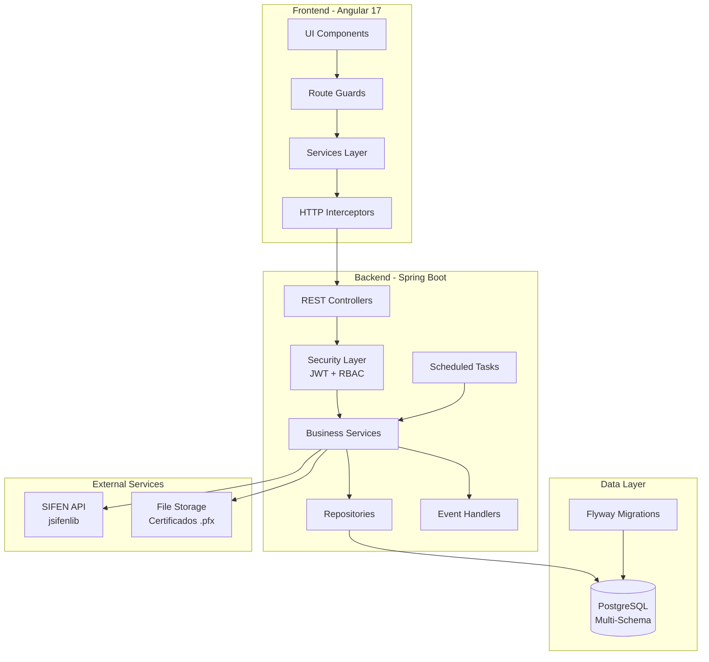

# Design Document

## Overview

El sistema de facturación electrónica FRC eFact es una plataforma multi-empresa que permite gestionar el ciclo completo de facturación legal y electrónica en Paraguay, con integración a SIFEN. El sistema implementa una arquitectura modular basada en Spring Boot (backend) y Angular 17 (frontend), con énfasis en seguridad, trazabilidad y procesamiento asíncrono.

## ⚠️ CONSIDERACIONES CRÍTICAS MULTI-EMPRESA

### Gestión de Certificados Digitales por Empresa

**IMPORTANTE**: A diferencia de sistemas single-tenant, este sistema debe manejar múltiples empresas, cada una con su propio certificado PFX para firma digital. Esto implica:

1. **NO usar configuración global de certificados**: No se puede configurar un certificado en `application.yml` o como bean singleton
2. **Carga dinámica por empresa**: Cada vez que se firma un documento, se debe cargar el certificado específico de la empresa desde:
   - Path almacenado en `empresa.certificado_path`
   - Contraseña encriptada en `empresa.certificado_password_encrypted`
3. **Liberación de recursos**: Después de cada firma, liberar el KeyStore de memoria (no mantener instancias cacheadas)
4. **Validación por empresa**: Verificar vigencia del certificado antes de cada operación de firma
5. **Seguridad**: Desencriptar contraseña solo en el momento de uso y limpiar de memoria inmediatamente después

### Integración con SIFEN Multi-Empresa

El servicio de integración con SIFEN debe:
- Recibir `empresaId` en cada operación
- Cargar el certificado correspondiente dinámicamente
- No mantener estado entre llamadas
- Manejar errores específicos por empresa

**Referencia de Implementación**: 
- Repositorio: https://github.com/GabFrank/franco-system-backend-filial/tree/facturacion-electronica
- Path: `src/main/java/com/franco/dev/service/sifen`
- **NOTA**: El ejemplo maneja una sola empresa, nuestro sistema debe adaptarlo para multi-empresa

### Architecture Principles

- **Multi-Tenancy**: Soporte para múltiples empresas con aislamiento de datos
- **Dynamic Certificate Loading**: Carga dinámica de certificados PFX por empresa
- **Role-Based Access Control (RBAC)**: Control granular de permisos por empresa y funcionalidad
- **Audit Trail**: Registro inmutable de todas las operaciones CRUD
- **Asynchronous Processing**: Schedulers para consultas periódicas a SIFEN
- **Event-Driven**: Eventos de dominio para operaciones críticas (aprobación DE, cancelación)
- **Security First**: Encriptación de datos sensibles, validación exhaustiva
- **API-First**: Backend expone APIs REST documentadas con OpenAPI

## Architecture

### High-Level Architecture




### Technology Stack

**Backend**
- Spring Boot 3.2+ (Java 17+)
- Spring Security 6+ con JWT
- Spring Data JPA + Hibernate
- Spring Scheduling para tareas periódicas
- PostgreSQL 15+ con esquemas múltiples
- Flyway para migraciones
- jsifenlib 0.2.4-frc.13 para integración SIFEN
- Bouncy Castle para firma digital de XML
- Apache POI para exportación Excel
- iText/Flying Saucer para generación PDF

**Frontend**
- Angular 17 con standalone components
- Angular Material 17
- RxJS para programación reactiva
- NgRx o Akita para state management
- Chart.js para dashboards
- Angular CDK para tablas virtualizadas

**Database Organization**
- Schema `persona`: usuarios, roles, permisos
- Schema `empresa`: empresas, configuraciones
- Schema `financiero`: timbrados, facturas, DEs, lotes
- Schema `productos`: catálogo de productos
- Schema `clientes`: información de clientes
- Schema `auditoria`: historial de cambios

## Components and Interfaces

### Backend Module Structure

```
com.frcefact
├── config/              # Configuraciones Spring
├── security/            # JWT, RBAC, filters
├── model/              # Entidades JPA
│   ├── persona/        # Usuario, Rol, Permiso
│   ├── empresa/        # Empresa, UsuarioEmpresa
│   ├── financiero/     # Timbrado, Factura, DE, Lote
│   ├── productos/      # Producto
│   ├── clientes/       # Cliente
│   └── auditoria/      # AuditLog
├── repository/         # Spring Data repositories
├── service/            # Lógica de negocio
│   ├── empresa/
│   ├── facturacion/
│   ├── sifen/          # Integración SIFEN
│   ├── certificado/    # Gestión certificados
│   └── reporte/        # Generación reportes
├── controller/         # REST endpoints
├── dto/                # Data Transfer Objects
├── scheduler/          # Tareas programadas
├── event/              # Domain events
├── exception/          # Exception handlers
└── util/               # Utilidades (validadores, encriptación)
```

### Frontend Module Structure

```
src/app
├── core/                    # Servicios singleton
│   ├── auth/               # AuthService, AuthGuard
│   ├── api/                # API clients
│   └── interceptors/       # HTTP interceptors
├── shared/                 # Componentes compartidos
│   ├── components/         # Botones, tablas, dialogs
│   ├── pipes/              # Formateo de datos
│   └── directives/         # Directivas custom
├── features/               # Módulos de funcionalidad
│   ├── dashboard/          # Dashboards usuario/empresa
│   ├── empresas/           # Gestión empresas
│   ├── timbrados/          # Gestión timbrados
│   ├── productos/          # Gestión productos
│   ├── clientes/           # Gestión clientes
│   ├── facturacion/        # Crear/editar facturas
│   ├── documentos/         # Gestión DEs y lotes
│   ├── reportes/           # Reportes y exportación
│   └── auditoria/          # Historial cambios
└── models/                 # Interfaces TypeScript
```


## Data Models

### Database Schema Design

#### Schema: persona

**Tabla: persona.usuario**
```sql
CREATE TABLE persona.usuario (
    id BIGSERIAL PRIMARY KEY,
    username VARCHAR(50) UNIQUE NOT NULL,
    email VARCHAR(100) UNIQUE NOT NULL,
    password_hash VARCHAR(255) NOT NULL,
    nombre_completo VARCHAR(200),
    is_active BOOLEAN DEFAULT true,
    ultimo_login TIMESTAMP,
    creado_en TIMESTAMP DEFAULT CURRENT_TIMESTAMP NOT NULL,
    creado_por VARCHAR(50),
    actualizado_en TIMESTAMP DEFAULT CURRENT_TIMESTAMP NOT NULL,
    actualizado_por VARCHAR(50)
);
```

**Tabla: persona.rol**
```sql
CREATE TABLE persona.rol (
    id BIGSERIAL PRIMARY KEY,
    nombre VARCHAR(50) UNIQUE NOT NULL, -- ADMIN, EMPRESA_ADMIN, FACTURADOR, LECTOR
    descripcion TEXT,
    creado_en TIMESTAMP DEFAULT CURRENT_TIMESTAMP NOT NULL
);
```

**Tabla: persona.usuario_rol**
```sql
CREATE TABLE persona.usuario_rol (
    id BIGSERIAL PRIMARY KEY,
    usuario_id BIGINT NOT NULL REFERENCES persona.usuario(id),
    rol_id BIGINT NOT NULL REFERENCES persona.rol(id),
    creado_en TIMESTAMP DEFAULT CURRENT_TIMESTAMP NOT NULL,
    UNIQUE(usuario_id, rol_id)
);
```

#### Schema: empresa

**Tabla: empresa.empresa**
```sql
CREATE TABLE empresa.empresa (
    id BIGSERIAL PRIMARY KEY,
    razon_social VARCHAR(200) NOT NULL,
    ruc VARCHAR(20) UNIQUE NOT NULL,
    nombre_fantasia VARCHAR(200),
    email VARCHAR(100),
    telefono VARCHAR(50),
    direccion TEXT,
    
    -- Datos fiscales
    tipo_sociedad VARCHAR(50),
    domicilio_fiscal_departamento VARCHAR(100),
    domicilio_fiscal_ciudad VARCHAR(100),
    domicilio_fiscal_codigo_ciudad VARCHAR(10),
    domicilio_fiscal_localidad VARCHAR(100),
    domicilio_fiscal_barrio VARCHAR(100),
    domicilio_fiscal_direccion TEXT,
    
    -- Actividad económica
    cod_actividad_economica_principal VARCHAR(20),
    desc_actividad_economica_principal VARCHAR(200),
    list_codigo_actividad_economica_secundaria TEXT,
    list_descripcion_actividad_economica_secundaria TEXT,
    
    -- Certificado digital
    certificado_path VARCHAR(500),
    certificado_password_encrypted TEXT,
    certificado_fecha_expiracion DATE,
    
    activo BOOLEAN DEFAULT true,
    creado_en TIMESTAMP DEFAULT CURRENT_TIMESTAMP NOT NULL,
    creado_por VARCHAR(50),
    actualizado_en TIMESTAMP DEFAULT CURRENT_TIMESTAMP NOT NULL,
    actualizado_por VARCHAR(50)
);
```

**Tabla: empresa.usuario_empresa**
```sql
CREATE TABLE empresa.usuario_empresa (
    id BIGSERIAL PRIMARY KEY,
    usuario_id BIGINT NOT NULL REFERENCES persona.usuario(id),
    empresa_id BIGINT NOT NULL REFERENCES empresa.empresa(id),
    rol_empresa VARCHAR(20) NOT NULL, -- ADMINISTRADOR, LECTOR
    activo BOOLEAN DEFAULT true,
    creado_en TIMESTAMP DEFAULT CURRENT_TIMESTAMP NOT NULL,
    creado_por VARCHAR(50),
    actualizado_en TIMESTAMP DEFAULT CURRENT_TIMESTAMP NOT NULL,
    actualizado_por VARCHAR(50),
    UNIQUE(usuario_id, empresa_id)
);
```

#### Schema: financiero

**Tabla: financiero.timbrado**
```sql
CREATE TABLE financiero.timbrado (
    id BIGSERIAL PRIMARY KEY,
    empresa_id BIGINT NOT NULL REFERENCES empresa.empresa(id),
    razon_social VARCHAR(200) NOT NULL,
    ruc VARCHAR(20) NOT NULL,
    numero VARCHAR(20) NOT NULL,
    is_electronico BOOLEAN DEFAULT false,
    csc_encrypted TEXT, -- Código de Seguridad del Contribuyente (encriptado)
    fecha_inicio DATE NOT NULL,
    fecha_fin DATE NOT NULL,
    
    -- Datos para documento electrónico
    email VARCHAR(100),
    tipo_sociedad VARCHAR(50),
    domicilio_fiscal_departamento VARCHAR(100),
    domicilio_fiscal_ciudad VARCHAR(100),
    domicilio_fiscal_codigo_ciudad VARCHAR(10),
    domicilio_fiscal_localidad VARCHAR(100),
    domicilio_fiscal_barrio VARCHAR(100),
    domicilio_fiscal_direccion TEXT,
    telefono VARCHAR(50),
    cod_actividad_economica_principal VARCHAR(20),
    desc_actividad_economica_principal VARCHAR(200),
    list_codigo_actividad_economica_secundaria TEXT,
    list_descripcion_actividad_economica_secundaria TEXT,
    
    activo BOOLEAN DEFAULT true,
    creado_en TIMESTAMP DEFAULT CURRENT_TIMESTAMP NOT NULL,
    creado_por VARCHAR(50),
    actualizado_en TIMESTAMP DEFAULT CURRENT_TIMESTAMP NOT NULL,
    actualizado_por VARCHAR(50)
);
```

**Tabla: financiero.timbrado_detalle**
```sql
CREATE TABLE financiero.timbrado_detalle (
    id BIGSERIAL PRIMARY KEY,
    timbrado_id BIGINT NOT NULL REFERENCES financiero.timbrado(id),
    punto_expedicion VARCHAR(10) NOT NULL,
    codigo_establecimiento_factura VARCHAR(10) NOT NULL,
    cantidad BIGINT NOT NULL,
    rango_desde BIGINT NOT NULL,
    rango_hasta BIGINT NOT NULL,
    numero_actual BIGINT NOT NULL DEFAULT 0,
    
    -- Ubicación del punto de expedición
    departamento VARCHAR(100),
    ciudad VARCHAR(100),
    codigo_ciudad VARCHAR(10),
    localidad VARCHAR(100),
    barrio VARCHAR(100),
    direccion TEXT,
    telefono VARCHAR(50),
    
    activo BOOLEAN DEFAULT true,
    creado_en TIMESTAMP DEFAULT CURRENT_TIMESTAMP NOT NULL,
    creado_por VARCHAR(50),
    actualizado_en TIMESTAMP DEFAULT CURRENT_TIMESTAMP NOT NULL,
    actualizado_por VARCHAR(50),
    
    CONSTRAINT chk_rango CHECK (rango_desde < rango_hasta),
    CONSTRAINT chk_numero_actual CHECK (numero_actual >= rango_desde AND numero_actual <= rango_hasta)
);
```


**Tabla: financiero.factura_legal**
```sql
CREATE TABLE financiero.factura_legal (
    id BIGSERIAL PRIMARY KEY,
    empresa_id BIGINT NOT NULL REFERENCES empresa.empresa(id),
    timbrado_detalle_id BIGINT NOT NULL REFERENCES financiero.timbrado_detalle(id),
    cliente_id BIGINT REFERENCES clientes.cliente(id),
    
    numero_factura INTEGER NOT NULL,
    fecha TIMESTAMP NOT NULL DEFAULT CURRENT_TIMESTAMP,
    credito BOOLEAN DEFAULT false,
    
    -- Datos del cliente (snapshot)
    nombre VARCHAR(200),
    ruc VARCHAR(20),
    direccion TEXT,
    
    -- Totales por tasa de IVA
    iva_parcial_0 DECIMAL(15,2) DEFAULT 0,
    iva_parcial_5 DECIMAL(15,2) DEFAULT 0,
    iva_parcial_10 DECIMAL(15,2) DEFAULT 0,
    total_parcial_0 DECIMAL(15,2) DEFAULT 0,
    total_parcial_5 DECIMAL(15,2) DEFAULT 0,
    total_parcial_10 DECIMAL(15,2) DEFAULT 0,
    
    descuento_final DECIMAL(15,2) DEFAULT 0,
    total_parcial DECIMAL(15,2) NOT NULL,
    total_final DECIMAL(15,2) NOT NULL,
    
    activo BOOLEAN DEFAULT true,
    creado_en TIMESTAMP DEFAULT CURRENT_TIMESTAMP NOT NULL,
    creado_por VARCHAR(50),
    actualizado_en TIMESTAMP DEFAULT CURRENT_TIMESTAMP NOT NULL,
    actualizado_por VARCHAR(50),
    
    UNIQUE(timbrado_detalle_id, numero_factura)
);

CREATE INDEX idx_factura_legal_empresa ON financiero.factura_legal(empresa_id);
CREATE INDEX idx_factura_legal_cliente ON financiero.factura_legal(cliente_id);
CREATE INDEX idx_factura_legal_fecha ON financiero.factura_legal(fecha);
```

**Tabla: financiero.factura_legal_item**
```sql
CREATE TABLE financiero.factura_legal_item (
    id BIGSERIAL PRIMARY KEY,
    factura_legal_id BIGINT NOT NULL REFERENCES financiero.factura_legal(id) ON DELETE CASCADE,
    producto_id BIGINT REFERENCES productos.producto(id),
    
    cantidad DECIMAL(10,3) NOT NULL,
    descripcion VARCHAR(500) NOT NULL,
    precio_unitario DECIMAL(15,2) NOT NULL,
    total DECIMAL(15,2) NOT NULL,
    
    creado_en TIMESTAMP DEFAULT CURRENT_TIMESTAMP NOT NULL,
    creado_por VARCHAR(50)
);

CREATE INDEX idx_factura_item_factura ON financiero.factura_legal_item(factura_legal_id);
```

**Tabla: financiero.documento_electronico**
```sql
CREATE TYPE financiero.estado_de_enum AS ENUM (
    'PENDIENTE',
    'EN_PROCESO',
    'APROBADO',
    'RECHAZADO',
    'CANCELADO',
    'ERROR'
);

CREATE TABLE financiero.documento_electronico (
    id BIGSERIAL PRIMARY KEY,
    factura_legal_id BIGINT NOT NULL UNIQUE REFERENCES financiero.factura_legal(id),
    lote_de_id BIGINT REFERENCES financiero.lote_de(id),
    
    -- Identificadores del DE
    cdc VARCHAR(44) UNIQUE,
    url_qr TEXT,
    numero_documento VARCHAR(50),
    tipo_documento VARCHAR(10) DEFAULT '1', -- 1=Factura electrónica
    
    -- XML del documento
    xml_original TEXT,
    xml_firmado TEXT,
    
    -- Estado y respuesta SIFEN
    estado financiero.estado_de_enum DEFAULT 'PENDIENTE',
    codigo_respuesta_sifen VARCHAR(10),
    mensaje_respuesta_sifen TEXT,
    fecha_emision TIMESTAMP DEFAULT CURRENT_TIMESTAMP,
    fecha_recepcion_sifen TIMESTAMP,
    
    activo BOOLEAN DEFAULT true,
    creado_en TIMESTAMP DEFAULT CURRENT_TIMESTAMP NOT NULL,
    creado_por VARCHAR(50),
    actualizado_en TIMESTAMP DEFAULT CURRENT_TIMESTAMP NOT NULL,
    actualizado_por VARCHAR(50)
);

CREATE INDEX idx_de_estado ON financiero.documento_electronico(estado);
CREATE INDEX idx_de_lote ON financiero.documento_electronico(lote_de_id);
CREATE INDEX idx_de_cdc ON financiero.documento_electronico(cdc);
```

**Tabla: financiero.lote_de**
```sql
CREATE TYPE financiero.estado_lote_enum AS ENUM (
    'PENDIENTE',
    'EN_PROCESO',
    'APROBADO',
    'RECHAZADO',
    'ERROR'
);

CREATE TABLE financiero.lote_de (
    id BIGSERIAL PRIMARY KEY,
    empresa_id BIGINT NOT NULL REFERENCES empresa.empresa(id),
    
    estado financiero.estado_lote_enum DEFAULT 'PENDIENTE',
    protocolo VARCHAR(50),
    respuesta_sifen TEXT,
    
    fecha_procesado TIMESTAMP,
    fecha_ultimo_intento TIMESTAMP,
    intentos INTEGER DEFAULT 0,
    
    creado_en TIMESTAMP DEFAULT CURRENT_TIMESTAMP NOT NULL,
    creado_por VARCHAR(50),
    actualizado_en TIMESTAMP DEFAULT CURRENT_TIMESTAMP NOT NULL,
    actualizado_por VARCHAR(50)
);

CREATE INDEX idx_lote_estado ON financiero.lote_de(estado);
CREATE INDEX idx_lote_empresa ON financiero.lote_de(empresa_id);
```

**Tabla: financiero.evento_cancelacion_de**
```sql
CREATE TYPE financiero.estado_evento_enum AS ENUM (
    'PENDIENTE',
    'APROBADO',
    'RECHAZADO'
);

CREATE TABLE financiero.evento_cancelacion_de (
    id BIGSERIAL PRIMARY KEY,
    documento_electronico_id BIGINT NOT NULL REFERENCES financiero.documento_electronico(id),
    
    evento_id VARCHAR(50) UNIQUE NOT NULL,
    fecha_firma TIMESTAMP NOT NULL,
    cdc_documento VARCHAR(44) NOT NULL,
    motivo_cancelacion TEXT NOT NULL,
    xml_evento TEXT,
    
    -- Respuesta SIFEN
    estado financiero.estado_evento_enum DEFAULT 'PENDIENTE',
    fecha_procesamiento TIMESTAMP,
    protocolo_autorizacion VARCHAR(50),
    codigo_respuesta VARCHAR(10),
    mensaje_respuesta TEXT,
    respuesta_bruta TEXT,
    
    activo BOOLEAN DEFAULT true,
    creado_en TIMESTAMP DEFAULT CURRENT_TIMESTAMP NOT NULL,
    creado_por VARCHAR(50),
    actualizado_en TIMESTAMP DEFAULT CURRENT_TIMESTAMP NOT NULL,
    actualizado_por VARCHAR(50)
);

CREATE INDEX idx_evento_de ON financiero.evento_cancelacion_de(documento_electronico_id);
CREATE INDEX idx_evento_estado ON financiero.evento_cancelacion_de(estado);
```


#### Schema: productos

**Tabla: productos.producto**
```sql
CREATE TABLE productos.producto (
    id BIGSERIAL PRIMARY KEY,
    empresa_id BIGINT NOT NULL REFERENCES empresa.empresa(id),
    
    codigo VARCHAR(50),
    descripcion VARCHAR(500) NOT NULL,
    precio DECIMAL(15,2) NOT NULL,
    iva INTEGER NOT NULL CHECK (iva IN (0, 5, 10)),
    balanza BOOLEAN DEFAULT false,
    
    activo BOOLEAN DEFAULT true,
    creado_en TIMESTAMP DEFAULT CURRENT_TIMESTAMP NOT NULL,
    creado_por VARCHAR(50),
    actualizado_en TIMESTAMP DEFAULT CURRENT_TIMESTAMP NOT NULL,
    actualizado_por VARCHAR(50),
    
    UNIQUE(empresa_id, codigo)
);

CREATE INDEX idx_producto_empresa ON productos.producto(empresa_id);
CREATE INDEX idx_producto_descripcion ON productos.producto(descripcion);
```

#### Schema: clientes

**Tabla: clientes.cliente**
```sql
CREATE TABLE clientes.cliente (
    id BIGSERIAL PRIMARY KEY,
    empresa_id BIGINT NOT NULL REFERENCES empresa.empresa(id),
    
    nombre VARCHAR(200) NOT NULL,
    razon_social VARCHAR(200),
    ruc VARCHAR(20),
    direccion TEXT,
    telefono VARCHAR(50),
    email VARCHAR(100),
    
    tributa BOOLEAN DEFAULT true,
    tipo_contribuyente VARCHAR(2) CHECK (tipo_contribuyente IN ('PF', 'PJ', 'EG')), -- Persona Física, Jurídica, Entidad Gubernamental
    
    activo BOOLEAN DEFAULT true,
    creado_en TIMESTAMP DEFAULT CURRENT_TIMESTAMP NOT NULL,
    creado_por VARCHAR(50),
    actualizado_en TIMESTAMP DEFAULT CURRENT_TIMESTAMP NOT NULL,
    actualizado_por VARCHAR(50)
);

CREATE INDEX idx_cliente_empresa ON clientes.cliente(empresa_id);
CREATE INDEX idx_cliente_ruc ON clientes.cliente(ruc);
CREATE INDEX idx_cliente_nombre ON clientes.cliente(nombre);
```

#### Schema: auditoria

**Tabla: auditoria.audit_log**
```sql
CREATE TYPE auditoria.accion_enum AS ENUM (
    'CREATE',
    'UPDATE',
    'DELETE',
    'LOGIN',
    'LOGOUT'
);

CREATE TABLE auditoria.audit_log (
    id BIGSERIAL PRIMARY KEY,
    usuario_id BIGINT REFERENCES persona.usuario(id),
    empresa_id BIGINT REFERENCES empresa.empresa(id),
    
    accion auditoria.accion_enum NOT NULL,
    entidad VARCHAR(100) NOT NULL, -- Nombre de la tabla/entidad
    entidad_id BIGINT, -- ID del registro afectado
    
    valores_anteriores JSONB,
    valores_nuevos JSONB,
    
    ip_address VARCHAR(50),
    user_agent TEXT,
    
    creado_en TIMESTAMP DEFAULT CURRENT_TIMESTAMP NOT NULL
);

CREATE INDEX idx_audit_usuario ON auditoria.audit_log(usuario_id);
CREATE INDEX idx_audit_empresa ON auditoria.audit_log(empresa_id);
CREATE INDEX idx_audit_entidad ON auditoria.audit_log(entidad, entidad_id);
CREATE INDEX idx_audit_fecha ON auditoria.audit_log(creado_en);
```

### Java Entity Models

**Usuario.java**
```java
@Entity
@Table(name = "usuario", schema = "persona")
public class Usuario {
    @Id
    @GeneratedValue(strategy = GenerationType.IDENTITY)
    private Long id;
    
    private String username;
    private String email;
    private String passwordHash;
    private String nombreCompleto;
    private Boolean isActive;
    private LocalDateTime ultimoLogin;
    
    @ManyToMany(fetch = FetchType.EAGER)
    @JoinTable(
        name = "usuario_rol",
        schema = "persona",
        joinColumns = @JoinColumn(name = "usuario_id"),
        inverseJoinColumns = @JoinColumn(name = "rol_id")
    )
    private Set<Rol> roles;
    
    @OneToMany(mappedBy = "usuario")
    private List<UsuarioEmpresa> empresas;
    
    // Audit fields
    private LocalDateTime creadoEn;
    private String creadoPor;
    private LocalDateTime actualizadoEn;
    private String actualizadoPor;
}
```

**Empresa.java**
```java
@Entity
@Table(name = "empresa", schema = "empresa")
public class Empresa {
    @Id
    @GeneratedValue(strategy = GenerationType.IDENTITY)
    private Long id;
    
    private String razonSocial;
    private String ruc;
    private String nombreFantasia;
    private String email;
    private String telefono;
    private String direccion;
    
    // Datos fiscales
    private String tipoSociedad;
    private String domicilioFiscalDepartamento;
    private String domicilioFiscalCiudad;
    private String domicilioFiscalCodigoCiudad;
    // ... otros campos fiscales
    
    // Certificado digital
    private String certificadoPath;
    private String certificadoPasswordEncrypted;
    private LocalDate certificadoFechaExpiracion;
    
    private Boolean activo;
    
    @OneToMany(mappedBy = "empresa")
    private List<UsuarioEmpresa> usuarios;
    
    @OneToMany(mappedBy = "empresa")
    private List<Timbrado> timbrados;
    
    // Audit fields
    private LocalDateTime creadoEn;
    private String creadoPor;
    private LocalDateTime actualizadoEn;
    private String actualizadoPor;
}
```

**FacturaLegal.java**
```java
@Entity
@Table(name = "factura_legal", schema = "financiero")
public class FacturaLegal {
    @Id
    @GeneratedValue(strategy = GenerationType.IDENTITY)
    private Long id;
    
    @ManyToOne(fetch = FetchType.LAZY)
    @JoinColumn(name = "empresa_id")
    private Empresa empresa;
    
    @ManyToOne(fetch = FetchType.EAGER)
    @JoinColumn(name = "timbrado_detalle_id")
    private TimbradoDetalle timbradoDetalle;
    
    @ManyToOne(fetch = FetchType.LAZY)
    @JoinColumn(name = "cliente_id")
    private Cliente cliente;
    
    private Integer numeroFactura;
    private LocalDateTime fecha;
    private Boolean credito;
    
    // Datos del cliente (snapshot)
    private String nombre;
    private String ruc;
    private String direccion;
    
    // Totales
    private BigDecimal ivaParcial0;
    private BigDecimal ivaParcial5;
    private BigDecimal ivaParcial10;
    private BigDecimal totalParcial0;
    private BigDecimal totalParcial5;
    private BigDecimal totalParcial10;
    private BigDecimal descuentoFinal;
    private BigDecimal totalParcial;
    private BigDecimal totalFinal;
    
    @OneToMany(mappedBy = "facturaLegal", cascade = CascadeType.ALL, orphanRemoval = true)
    private List<FacturaLegalItem> items = new ArrayList<>();
    
    @OneToOne(mappedBy = "facturaLegal")
    private DocumentoElectronico documentoElectronico;
    
    private Boolean activo;
    
    // Audit fields
    private LocalDateTime creadoEn;
    private String creadoPor;
    private LocalDateTime actualizadoEn;
    private String actualizadoPor;
}
```


**DocumentoElectronico.java**
```java
@Entity
@Table(name = "documento_electronico", schema = "financiero")
@TypeDef(name = "estado_de_enum", typeClass = PostgreSQLEnumType.class)
public class DocumentoElectronico {
    @Id
    @GeneratedValue(strategy = GenerationType.IDENTITY)
    private Long id;
    
    @OneToOne(fetch = FetchType.LAZY)
    @JoinColumn(name = "factura_legal_id", unique = true)
    private FacturaLegal facturaLegal;
    
    @ManyToOne(fetch = FetchType.LAZY)
    @JoinColumn(name = "lote_de_id")
    private LoteDE loteDE;
    
    private String cdc;
    private String urlQr;
    private String numeroDocumento;
    private String tipoDocumento;
    
    @Column(columnDefinition = "TEXT")
    private String xmlOriginal;
    
    @Column(columnDefinition = "TEXT")
    private String xmlFirmado;
    
    @Enumerated(EnumType.STRING)
    @Type(type = "estado_de_enum")
    @Column(columnDefinition = "financiero.estado_de_enum")
    private EstadoDE estado;
    
    private String codigoRespuestaSifen;
    private String mensajeRespuestaSifen;
    private LocalDateTime fechaEmision;
    private LocalDateTime fechaRecepcionSifen;
    
    private Boolean activo;
    
    // Audit fields
    private LocalDateTime creadoEn;
    private String creadoPor;
    private LocalDateTime actualizadoEn;
    private String actualizadoPor;
}

public enum EstadoDE {
    PENDIENTE,
    EN_PROCESO,
    APROBADO,
    RECHAZADO,
    CANCELADO,
    ERROR
}
```

### TypeScript Models

**empresa.model.ts**
```typescript
export interface Empresa {
  id: number;
  razonSocial: string;
  ruc: string;
  nombreFantasia?: string;
  email?: string;
  telefono?: string;
  direccion?: string;
  tipoSociedad?: string;
  domicilioFiscal: DomicilioFiscal;
  actividadEconomica: ActividadEconomica;
  certificado?: CertificadoInfo;
  activo: boolean;
  creadoEn: string;
}

export interface DomicilioFiscal {
  departamento: string;
  ciudad: string;
  codigoCiudad: string;
  localidad: string;
  barrio: string;
  direccion: string;
}

export interface ActividadEconomica {
  codigoPrincipal: string;
  descripcionPrincipal: string;
  codigosSecundarios?: string[];
  descripcionesSecundarias?: string[];
}
```

**factura.model.ts**
```typescript
export interface FacturaLegal {
  id?: number;
  empresaId: number;
  timbradoDetalleId: number;
  clienteId?: number;
  numeroFactura?: number;
  fecha: string;
  credito: boolean;
  
  // Datos cliente
  nombre: string;
  ruc?: string;
  direccion?: string;
  
  // Items
  items: FacturaLegalItem[];
  
  // Totales
  ivaParcial0: number;
  ivaParcial5: number;
  ivaParcial10: number;
  totalParcial0: number;
  totalParcial5: number;
  totalParcial10: number;
  descuentoFinal: number;
  totalParcial: number;
  totalFinal: number;
}

export interface FacturaLegalItem {
  id?: number;
  productoId?: number;
  cantidad: number;
  descripcion: string;
  precioUnitario: number;
  total: number;
}
```

**documento-electronico.model.ts**
```typescript
export interface DocumentoElectronico {
  id: number;
  facturaLegalId: number;
  loteDeId?: number;
  cdc?: string;
  urlQr?: string;
  numeroDocumento?: string;
  estado: EstadoDE;
  codigoRespuestaSifen?: string;
  mensajeRespuestaSifen?: string;
  fechaEmision: string;
  fechaRecepcionSifen?: string;
}

export enum EstadoDE {
  PENDIENTE = 'PENDIENTE',
  EN_PROCESO = 'EN_PROCESO',
  APROBADO = 'APROBADO',
  RECHAZADO = 'RECHAZADO',
  CANCELADO = 'CANCELADO',
  ERROR = 'ERROR'
}
```

## Error Handling

### Backend Exception Hierarchy

```java
// Base exception
public class FrcEfactException extends RuntimeException {
    private final String errorCode;
    private final HttpStatus httpStatus;
}

// Specific exceptions
public class EmpresaNotFoundException extends FrcEfactException { }
public class TimbradoVencidoException extends FrcEfactException { }
public class RangoNumeracionAgotadoException extends FrcEfactException { }
public class PermisosDenegadosException extends FrcEfactException { }
public class SifenIntegrationException extends FrcEfactException { }
public class CertificadoInvalidoException extends FrcEfactException { }
public class ValidationException extends FrcEfactException { }
```

### Global Exception Handler

```java
@RestControllerAdvice
public class GlobalExceptionHandler {
    
    @ExceptionHandler(FrcEfactException.class)
    public ResponseEntity<ErrorResponse> handleFrcEfactException(FrcEfactException ex) {
        ErrorResponse error = ErrorResponse.builder()
            .timestamp(LocalDateTime.now())
            .errorCode(ex.getErrorCode())
            .message(ex.getMessage())
            .build();
        return ResponseEntity.status(ex.getHttpStatus()).body(error);
    }
    
    @ExceptionHandler(MethodArgumentNotValidException.class)
    public ResponseEntity<ValidationErrorResponse> handleValidationException(
            MethodArgumentNotValidException ex) {
        // Return field-level validation errors
    }
    
    @ExceptionHandler(AccessDeniedException.class)
    public ResponseEntity<ErrorResponse> handleAccessDenied(AccessDeniedException ex) {
        // Return 403 Forbidden
    }
}
```

### Frontend Error Handling

```typescript
@Injectable()
export class ErrorInterceptor implements HttpInterceptor {
  constructor(
    private snackBar: MatSnackBar,
    private router: Router
  ) {}

  intercept(req: HttpRequest<any>, next: HttpHandler): Observable<HttpEvent<any>> {
    return next.handle(req).pipe(
      catchError((error: HttpErrorResponse) => {
        if (error.status === 401) {
          // Redirect to login
          this.router.navigate(['/login']);
        } else if (error.status === 403) {
          this.snackBar.open('No tiene permisos para esta operación', 'Cerrar', {
            duration: 5000
          });
        } else if (error.status === 400 && error.error.validationErrors) {
          // Handle validation errors
        } else {
          this.snackBar.open(
            error.error?.message || 'Error inesperado',
            'Cerrar',
            { duration: 5000 }
          );
        }
        return throwError(() => error);
      })
    );
  }
}
```


## Security Architecture

### Role-Based Access Control (RBAC)

**Roles del Sistema:**
- **ADMIN**: Acceso completo al sistema, gestión de usuarios
- **EMPRESA_ADMIN**: Administración completa de su empresa
- **FACTURADOR**: Crear y editar facturas, productos, clientes
- **LECTOR**: Solo visualización de datos

**Permisos por Empresa:**
- **ADMINISTRADOR**: CRUD completo en la empresa
- **LECTOR**: Solo lectura en la empresa

### Security Implementation

```java
@Configuration
@EnableMethodSecurity
public class SecurityConfig {
    
    @Bean
    public SecurityFilterChain filterChain(HttpSecurity http) throws Exception {
        http
            .csrf().disable()
            .authorizeHttpRequests(auth -> auth
                .requestMatchers("/api/auth/**").permitAll()
                .requestMatchers("/api/admin/**").hasRole("ADMIN")
                .requestMatchers("/api/empresas/**").authenticated()
                .anyRequest().authenticated()
            )
            .addFilterBefore(jwtAuthenticationFilter(), 
                UsernamePasswordAuthenticationFilter.class);
        return http.build();
    }
}
```

### Method-Level Security

```java
@Service
public class FacturaService {
    
    @PreAuthorize("@empresaSecurityService.hasAccess(#empresaId, 'WRITE')")
    public FacturaLegal crearFactura(Long empresaId, FacturaLegalDto dto) {
        // Implementation
    }
    
    @PreAuthorize("@empresaSecurityService.hasAccess(#empresaId, 'READ')")
    public List<FacturaLegal> listarFacturas(Long empresaId) {
        // Implementation
    }
}

@Component
public class EmpresaSecurityService {
    
    public boolean hasAccess(Long empresaId, String permission) {
        Usuario usuario = getCurrentUser();
        UsuarioEmpresa ue = usuarioEmpresaRepository
            .findByUsuarioAndEmpresa(usuario.getId(), empresaId);
        
        if (ue == null) return false;
        
        if (permission.equals("WRITE")) {
            return ue.getRolEmpresa().equals("ADMINISTRADOR");
        }
        return true; // READ access
    }
}
```

### Data Encryption

```java
@Component
public class EncryptionService {
    
    @Value("${encryption.secret.key}")
    private String secretKey;
    
    public String encrypt(String data) {
        // AES-256 encryption
        Cipher cipher = Cipher.getInstance("AES/GCM/NoPadding");
        // ... implementation
    }
    
    public String decrypt(String encryptedData) {
        // AES-256 decryption
        // ... implementation
    }
}

// Usage for sensitive data
@Entity
public class Timbrado {
    @Column(name = "csc_encrypted")
    private String cscEncrypted;
    
    @Transient
    public String getCsc() {
        return encryptionService.decrypt(cscEncrypted);
    }
    
    public void setCsc(String csc) {
        this.cscEncrypted = encryptionService.encrypt(csc);
    }
}
```


## SIFEN Integration Architecture

### jsifenlib Integration

```java
@Service
public class SifenService {
    
    @Value("${sifen.api.url}")
    private String sifenApiUrl;
    
    @Value("${sifen.environment}") // test or production
    private String environment;
    
    public LoteResponse enviarLote(LoteDE lote) throws SifenException {
        try {
            // Configurar jsifenlib
            SifenConfig config = SifenConfig.builder()
                .environment(environment)
                .apiUrl(sifenApiUrl)
                .build();
            
            SifenClient client = new SifenClient(config);
            
            // Preparar documentos del lote
            List<DocumentoElectronicoSifen> documentos = lote.getDocumentosElectronicos()
                .stream()
                .map(this::convertirADocumentoSifen)
                .collect(Collectors.toList());
            
            // Enviar lote
            LoteRequest request = LoteRequest.builder()
                .documentos(documentos)
                .build();
            
            return client.enviarLote(request);
            
        } catch (Exception e) {
            throw new SifenIntegrationException("Error al enviar lote a SIFEN", e);
        }
    }
    
    public ConsultaResponse consultarDE(String cdc) throws SifenException {
        SifenClient client = new SifenClient(getSifenConfig());
        return client.consultarDocumento(cdc);
    }
    
    public EventoResponse enviarEventoCancelacion(EventoCancelacionDE evento) 
            throws SifenException {
        SifenClient client = new SifenClient(getSifenConfig());
        
        EventoRequest request = EventoRequest.builder()
            .eventoId(evento.getEventoId())
            .cdc(evento.getCdcDocumento())
            .motivo(evento.getMotivoCancelacion())
            .xmlEvento(evento.getXmlEvento())
            .build();
        
        return client.enviarEvento(request);
    }
}
```

### XML Generation and Signing

```java
@Service
public class DocumentoElectronicoService {
    
    @Autowired
    private CertificadoService certificadoService;
    
    @Autowired
    private XmlGeneratorService xmlGeneratorService;
    
    /**
     * Genera un Documento Electrónico a partir de una Factura Legal.
     * IMPORTANTE: Usa el certificado específico de la empresa.
     */
    public DocumentoElectronico generarDE(FacturaLegal factura) {
        Empresa empresa = factura.getEmpresa();
        
        // Validar que la empresa tiene certificado vigente
        certificadoService.validarCertificadoVigente(empresa);
        
        // 1. Generar XML original según especificación SIFEN
        String xmlOriginal = xmlGeneratorService.generarXmlOriginal(factura);
        
        // 2. Firmar XML con certificado de la empresa
        // NOTA: El servicio carga dinámicamente el certificado de la empresa
        String xmlFirmado = certificadoService.firmarXml(xmlOriginal, empresa.getId());
        
        // 3. Generar CDC (Código de Control de 44 caracteres)
        String cdc = xmlGeneratorService.generarCDC(factura, xmlFirmado);
        
        // 4. Generar URL QR
        String urlQr = xmlGeneratorService.generarUrlQr(cdc);
        
        // 5. Crear entidad DE
        DocumentoElectronico de = new DocumentoElectronico();
        de.setFacturaLegal(factura);
        de.setXmlOriginal(xmlOriginal);
        de.setXmlFirmado(xmlFirmado);
        de.setCdc(cdc);
        de.setUrlQr(urlQr);
        de.setEstado(EstadoDE.PENDIENTE);
        de.setFechaEmision(LocalDateTime.now());
        
        return documentoElectronicoRepository.save(de);
    }
    
    private String generarXmlOriginal(FacturaLegal factura) {
        // Usar librería XML o template engine
        // Seguir especificación de SIFEN para estructura XML
        // ... implementation
    }
    
    private String generarCDC(FacturaLegal factura, String xmlFirmado) {
        // CDC = 44 caracteres según especificación SIFEN
        // Formato: TTDDDDDDDDDDEEEEEEEEEEEEEEEEEEEEEEEEEEEEEEE
        // TT = Tipo documento (01 = Factura)
        // D = Dígitos del RUC
        // E = Número de documento + dígito verificador
        // ... implementation
    }
}
```

### Certificate Management

**IMPORTANTE: Multi-Empresa con Certificados Dinámicos**

El sistema debe manejar múltiples empresas, cada una con su propio certificado PFX. A diferencia de sistemas single-tenant, NO se puede configurar un certificado global. El servicio debe:

1. **Cargar el certificado dinámicamente** según la empresa que genera el DE
2. **Desencriptar la contraseña** almacenada en la base de datos
3. **Validar vigencia** del certificado antes de firmar
4. **Liberar recursos** después de cada firma (no mantener KeyStore en memoria)

```java
@Service
public class CertificadoService {
    
    @Autowired
    private EncryptionService encryptionService;
    
    @Autowired
    private EmpresaRepository empresaRepository;
    
    /**
     * Firma un XML con el certificado de una empresa específica.
     * IMPORTANTE: Carga el certificado dinámicamente por empresa.
     * 
     * @param xml XML a firmar
     * @param empresaId ID de la empresa (para obtener su certificado)
     * @return XML firmado digitalmente
     */
    public String firmarXml(String xml, Long empresaId) {
        Empresa empresa = empresaRepository.findById(empresaId)
            .orElseThrow(() -> new EntityNotFoundException("Empresa no encontrada"));
        
        // Validar que el certificado existe y está vigente
        validarCertificadoVigente(empresa);
        
        // Desencriptar contraseña del certificado
        String password = encryptionService.decrypt(empresa.getCertificadoPasswordEncrypted());
        
        try {
            // Cargar certificado .pfx de la empresa
            KeyStore keyStore = KeyStore.getInstance("PKCS12");
            FileInputStream fis = new FileInputStream(empresa.getCertificadoPath());
            keyStore.load(fis, password.toCharArray());
            fis.close();
            
            // Obtener clave privada
            String alias = keyStore.aliases().nextElement();
            PrivateKey privateKey = (PrivateKey) keyStore.getKey(
                alias, 
                password.toCharArray()
            );
            
            X509Certificate certificate = (X509Certificate) keyStore.getCertificate(alias);
            
            // Firmar XML usando Bouncy Castle o Apache Santuario
            XMLSignatureFactory factory = XMLSignatureFactory.getInstance("DOM");
            // ... firma digital del XML según especificación SIFEN
            
            return xmlFirmado;
            
        } catch (Exception e) {
            throw new CertificadoInvalidoException(
                "Error al firmar XML con certificado de empresa " + empresaId, e);
        } finally {
            // Limpiar contraseña de memoria
            password = null;
        }
    }
    
    /**
     * Valida que el certificado de una empresa existe y está vigente.
     */
    public void validarCertificadoVigente(Empresa empresa) {
        if (empresa.getCertificadoPath() == null || empresa.getCertificadoPath().isEmpty()) {
            throw new CertificadoInvalidoException(
                "La empresa " + empresa.getRazonSocial() + " no tiene certificado configurado");
        }
        
        if (!empresa.isCertificadoVigente()) {
            throw new CertificadoInvalidoException(
                "El certificado de la empresa " + empresa.getRazonSocial() + " ha expirado");
        }
        
        // Verificar que el archivo existe
        File certFile = new File(empresa.getCertificadoPath());
        if (!certFile.exists()) {
            throw new CertificadoInvalidoException(
                "No se encuentra el archivo de certificado: " + empresa.getCertificadoPath());
        }
    }
    
    /**
     * Carga y valida un certificado sin firmar (para testing).
     */
    public void validarCertificado(String certificadoPath, String password) {
        try {
            KeyStore keyStore = KeyStore.getInstance("PKCS12");
            FileInputStream fis = new FileInputStream(certificadoPath);
            keyStore.load(fis, password.toCharArray());
            
            // Verificar fecha de expiración
            String alias = keyStore.aliases().nextElement();
            Certificate cert = keyStore.getCertificate(alias);
            
            if (cert instanceof X509Certificate) {
                X509Certificate x509 = (X509Certificate) cert;
                x509.checkValidity(); // Throws exception if expired
            }
            
        } catch (Exception e) {
            throw new CertificadoInvalidoException("Certificado inválido o expirado", e);
        }
    }
}
```


## Asynchronous Processing and Schedulers

### Scheduler Configuration

```java
@Configuration
@EnableScheduling
public class SchedulerConfig {
    
    @Bean
    public TaskScheduler taskScheduler() {
        ThreadPoolTaskScheduler scheduler = new ThreadPoolTaskScheduler();
        scheduler.setPoolSize(5);
        scheduler.setThreadNamePrefix("sifen-scheduler-");
        scheduler.initialize();
        return scheduler;
    }
}
```

### Scheduled Tasks

```java
@Component
public class SifenScheduledTasks {
    
    @Autowired
    private LoteDEService loteDEService;
    
    @Autowired
    private DocumentoElectronicoService deService;
    
    // Consultar estado de lotes cada 5 minutos
    @Scheduled(fixedDelay = 300000) // 5 minutes
    public void consultarEstadoLotes() {
        log.info("Iniciando consulta de estado de lotes...");
        
        List<LoteDE> lotesEnProceso = loteDEService
            .findByEstado(EstadoLoteDE.EN_PROCESO);
        
        for (LoteDE lote : lotesEnProceso) {
            try {
                loteDEService.consultarYActualizarEstado(lote);
            } catch (Exception e) {
                log.error("Error al consultar lote {}: {}", lote.getId(), e.getMessage());
            }
        }
    }
    
    // Consultar DEs pendientes cada 10 minutos
    @Scheduled(fixedDelay = 600000) // 10 minutes
    public void consultarDEsPendientes() {
        log.info("Iniciando consulta de DEs pendientes...");
        
        List<DocumentoElectronico> desPendientes = deService
            .findByEstadoIn(Arrays.asList(EstadoDE.PENDIENTE, EstadoDE.EN_PROCESO));
        
        for (DocumentoElectronico de : desPendientes) {
            if (de.getCdc() != null) {
                try {
                    deService.consultarYActualizarEstado(de);
                } catch (Exception e) {
                    log.error("Error al consultar DE {}: {}", de.getId(), e.getMessage());
                }
            }
        }
    }
    
    // Reintentar lotes con error cada hora
    @Scheduled(cron = "0 0 * * * *") // Every hour
    public void reintentarLotesConError() {
        log.info("Reintentando lotes con error...");
        
        List<LoteDE> lotesError = loteDEService.findByEstadoAndIntentosLessThan(
            EstadoLoteDE.ERROR, 
            3
        );
        
        for (LoteDE lote : lotesError) {
            try {
                loteDEService.reenviarLote(lote);
            } catch (Exception e) {
                log.error("Error al reintentar lote {}: {}", lote.getId(), e.getMessage());
            }
        }
    }
    
    // Alertar certificados próximos a vencer (diario a las 8 AM)
    @Scheduled(cron = "0 0 8 * * *")
    public void alertarCertificadosPorVencer() {
        log.info("Verificando certificados próximos a vencer...");
        
        LocalDate hoy = LocalDate.now();
        LocalDate en30Dias = hoy.plusDays(30);
        
        List<Empresa> empresas = empresaService
            .findByCertificadoFechaExpiracionBetween(hoy, en30Dias);
        
        for (Empresa empresa : empresas) {
            notificacionService.alertarCertificadoPorVencer(empresa);
        }
    }
}
```

### Reactive Event Processing

```java
@Component
public class DocumentoElectronicoEventListener {
    
    @Autowired
    private NotificacionService notificacionService;
    
    @EventListener
    @Async
    public void onDEAprobado(DEAprobadoEvent event) {
        DocumentoElectronico de = event.getDocumentoElectronico();
        
        // Notificar al usuario
        notificacionService.notificarDEAprobado(de);
        
        // Actualizar estadísticas
        estadisticasService.actualizarEstadisticas(de.getFacturaLegal().getEmpresa());
    }
    
    @EventListener
    @Async
    public void onDERechazado(DERechazadoEvent event) {
        DocumentoElectronico de = event.getDocumentoElectronico();
        
        // Notificar al usuario con motivo del rechazo
        notificacionService.notificarDERechazado(
            de, 
            de.getMensajeRespuestaSifen()
        );
    }
    
    @EventListener
    @Async
    public void onLoteAprobado(LoteAprobadoEvent event) {
        LoteDE lote = event.getLote();
        
        // Actualizar todos los DEs del lote
        lote.getDocumentosElectronicos().forEach(de -> {
            de.setEstado(EstadoDE.APROBADO);
            documentoElectronicoRepository.save(de);
        });
    }
}
```


## Audit Trail Implementation

### Audit Interceptor

```java
@Aspect
@Component
public class AuditAspect {
    
    @Autowired
    private AuditLogService auditLogService;
    
    @Autowired
    private HttpServletRequest request;
    
    @Around("@annotation(Auditable)")
    public Object auditMethod(ProceedingJoinPoint joinPoint) throws Throwable {
        Auditable auditable = getAuditableAnnotation(joinPoint);
        
        // Capturar valores anteriores (para UPDATE)
        Object valorAnterior = null;
        if (auditable.action() == AccionEnum.UPDATE) {
            valorAnterior = obtenerValorAnterior(joinPoint);
        }
        
        // Ejecutar método
        Object result = joinPoint.proceed();
        
        // Registrar en audit log
        AuditLog log = AuditLog.builder()
            .usuarioId(getCurrentUserId())
            .empresaId(getEmpresaIdFromContext())
            .accion(auditable.action())
            .entidad(auditable.entity())
            .entidadId(extractEntityId(result))
            .valoresAnteriores(toJson(valorAnterior))
            .valoresNuevos(toJson(result))
            .ipAddress(request.getRemoteAddr())
            .userAgent(request.getHeader("User-Agent"))
            .build();
        
        auditLogService.save(log);
        
        return result;
    }
}

// Usage
@Service
public class EmpresaService {
    
    @Auditable(entity = "Empresa", action = AccionEnum.CREATE)
    public Empresa crearEmpresa(EmpresaDto dto) {
        // Implementation
    }
    
    @Auditable(entity = "Empresa", action = AccionEnum.UPDATE)
    public Empresa actualizarEmpresa(Long id, EmpresaDto dto) {
        // Implementation
    }
}
```

### JPA Entity Listeners for Automatic Audit

```java
@EntityListeners(AuditingEntityListener.class)
@MappedSuperclass
public abstract class AuditableEntity {
    
    @CreatedDate
    @Column(name = "creado_en", nullable = false, updatable = false)
    private LocalDateTime creadoEn;
    
    @CreatedBy
    @Column(name = "creado_por", length = 50)
    private String creadoPor;
    
    @LastModifiedDate
    @Column(name = "actualizado_en", nullable = false)
    private LocalDateTime actualizadoEn;
    
    @LastModifiedBy
    @Column(name = "actualizado_por", length = 50)
    private String actualizadoPor;
}

@Configuration
@EnableJpaAuditing
public class JpaAuditingConfig {
    
    @Bean
    public AuditorAware<String> auditorProvider() {
        return () -> {
            Authentication auth = SecurityContextHolder.getContext().getAuthentication();
            if (auth != null && auth.isAuthenticated()) {
                return Optional.of(auth.getName());
            }
            return Optional.of("SYSTEM");
        };
    }
}
```

## Dashboard and Reporting

### Dashboard Service

```java
@Service
public class DashboardService {
    
    public DashboardUsuarioDto getDashboardUsuario(Long usuarioId) {
        Usuario usuario = usuarioRepository.findById(usuarioId)
            .orElseThrow(() -> new UsuarioNotFoundException(usuarioId));
        
        return DashboardUsuarioDto.builder()
            .cantidadEmpresas(usuario.getEmpresas().size())
            .ultimoAcceso(usuario.getUltimoLogin())
            .ultimasActividades(auditLogService.getUltimasActividades(usuarioId, 10))
            .facturasCreadas(facturaService.countByUsuarioAndMesActual(usuarioId))
            .build();
    }
    
    public DashboardEmpresaDto getDashboardEmpresa(Long empresaId) {
        LocalDateTime inicioMes = LocalDateTime.now().withDayOfMonth(1).withHour(0).withMinute(0);
        
        List<FacturaLegal> facturasMes = facturaRepository
            .findByEmpresaIdAndFechaGreaterThanEqual(empresaId, inicioMes);
        
        BigDecimal totalMes = facturasMes.stream()
            .map(FacturaLegal::getTotalFinal)
            .reduce(BigDecimal.ZERO, BigDecimal::add);
        
        Map<Integer, BigDecimal> totalesPorIva = calcularTotalesPorIva(facturasMes);
        
        List<ClienteRankingDto> rankingClientes = facturaRepository
            .getRankingClientesPorMonto(empresaId, 10);
        
        return DashboardEmpresaDto.builder()
            .totalFacturasEmitidas(facturaRepository.countByEmpresaId(empresaId))
            .totalMesActual(totalMes)
            .totalIva10(totalesPorIva.get(10))
            .totalIva5(totalesPorIva.get(5))
            .totalIva0(totalesPorIva.get(0))
            .rankingClientes(rankingClientes)
            .build();
    }
}
```

### Report Service

```java
@Service
public class ReporteService {
    
    public List<FacturaReporteDto> reporteFacturas(FacturaFiltroDto filtro) {
        Specification<FacturaLegal> spec = FacturaSpecification.builder()
            .empresaId(filtro.getEmpresaId())
            .fechaDesde(filtro.getFechaDesde())
            .fechaHasta(filtro.getFechaHasta())
            .clienteId(filtro.getClienteId())
            .estadoDE(filtro.getEstadoDE())
            .build();
        
        return facturaRepository.findAll(spec).stream()
            .map(this::toReporteDto)
            .collect(Collectors.toList());
    }
    
    public byte[] exportarReporteExcel(List<FacturaReporteDto> facturas) {
        try (Workbook workbook = new XSSFWorkbook()) {
            Sheet sheet = workbook.createSheet("Facturas");
            
            // Header row
            Row headerRow = sheet.createRow(0);
            headerRow.createCell(0).setCellValue("Número");
            headerRow.createCell(1).setCellValue("Fecha");
            headerRow.createCell(2).setCellValue("Cliente");
            headerRow.createCell(3).setCellValue("Total");
            // ... más columnas
            
            // Data rows
            int rowNum = 1;
            for (FacturaReporteDto factura : facturas) {
                Row row = sheet.createRow(rowNum++);
                row.createCell(0).setCellValue(factura.getNumeroFactura());
                row.createCell(1).setCellValue(factura.getFecha().toString());
                row.createCell(2).setCellValue(factura.getClienteNombre());
                row.createCell(3).setCellValue(factura.getTotalFinal().doubleValue());
                // ... más celdas
            }
            
            ByteArrayOutputStream outputStream = new ByteArrayOutputStream();
            workbook.write(outputStream);
            return outputStream.toByteArray();
            
        } catch (IOException e) {
            throw new ReporteException("Error al generar Excel", e);
        }
    }
    
    public byte[] exportarReportePDF(List<FacturaReporteDto> facturas) {
        // Usar iText o Flying Saucer para generar PDF
        // ... implementation
    }
}
```


## Frontend Architecture

### State Management Strategy

```typescript
// Using NgRx for complex state management
// Store structure
interface AppState {
  auth: AuthState;
  empresas: EmpresaState;
  facturacion: FacturacionState;
  documentos: DocumentoState;
}

// Actions
export const loadEmpresas = createAction('[Empresa] Load Empresas');
export const loadEmpresasSuccess = createAction(
  '[Empresa] Load Empresas Success',
  props<{ empresas: Empresa[] }>()
);

// Reducer
export const empresaReducer = createReducer(
  initialState,
  on(loadEmpresasSuccess, (state, { empresas }) => ({
    ...state,
    empresas,
    loading: false
  }))
);

// Effects
@Injectable()
export class EmpresaEffects {
  loadEmpresas$ = createEffect(() =>
    this.actions$.pipe(
      ofType(loadEmpresas),
      switchMap(() =>
        this.empresaService.getEmpresas().pipe(
          map(empresas => loadEmpresasSuccess({ empresas })),
          catchError(error => of(loadEmpresasFailure({ error })))
        )
      )
    )
  );
}
```

### Smart vs Presentational Components

```typescript
// Smart Component (Container)
@Component({
  selector: 'app-factura-list',
  template: `
    <app-factura-table
      [facturas]="facturas$ | async"
      [loading]="loading$ | async"
      (edit)="onEdit($event)"
      (delete)="onDelete($event)">
    </app-factura-table>
  `
})
export class FacturaListComponent implements OnInit {
  facturas$ = this.store.select(selectFacturas);
  loading$ = this.store.select(selectFacturasLoading);
  
  constructor(private store: Store) {}
  
  ngOnInit() {
    this.store.dispatch(loadFacturas());
  }
  
  onEdit(factura: FacturaLegal) {
    this.router.navigate(['/facturas', factura.id, 'edit']);
  }
}

// Presentational Component
@Component({
  selector: 'app-factura-table',
  template: `
    <mat-table [dataSource]="facturas">
      <!-- Column definitions -->
    </mat-table>
  `
})
export class FacturaTableComponent {
  @Input() facturas: FacturaLegal[];
  @Input() loading: boolean;
  @Output() edit = new EventEmitter<FacturaLegal>();
  @Output() delete = new EventEmitter<FacturaLegal>();
}
```

### Reactive Forms for Facturación

```typescript
@Component({
  selector: 'app-factura-form',
  templateUrl: './factura-form.component.html'
})
export class FacturaFormComponent implements OnInit {
  facturaForm: FormGroup;
  itemsFormArray: FormArray;
  
  constructor(
    private fb: FormBuilder,
    private facturaService: FacturaService
  ) {}
  
  ngOnInit() {
    this.facturaForm = this.fb.group({
      empresaId: ['', Validators.required],
      timbradoDetalleId: ['', Validators.required],
      clienteId: [''],
      nombre: ['', Validators.required],
      ruc: [''],
      direccion: [''],
      credito: [false],
      items: this.fb.array([]),
      descuentoFinal: [0]
    });
    
    this.itemsFormArray = this.facturaForm.get('items') as FormArray;
    
    // Recalcular totales cuando cambian items
    this.itemsFormArray.valueChanges.pipe(
      debounceTime(300)
    ).subscribe(() => this.recalcularTotales());
  }
  
  agregarItem() {
    const itemForm = this.fb.group({
      productoId: [''],
      cantidad: [1, [Validators.required, Validators.min(0.001)]],
      descripcion: ['', Validators.required],
      precioUnitario: [0, [Validators.required, Validators.min(0)]],
      total: [{ value: 0, disabled: true }]
    });
    
    // Calcular total del item automáticamente
    itemForm.get('cantidad').valueChanges.subscribe(() => 
      this.calcularTotalItem(itemForm)
    );
    itemForm.get('precioUnitario').valueChanges.subscribe(() => 
      this.calcularTotalItem(itemForm)
    );
    
    this.itemsFormArray.push(itemForm);
  }
  
  calcularTotalItem(itemForm: FormGroup) {
    const cantidad = itemForm.get('cantidad').value;
    const precio = itemForm.get('precioUnitario').value;
    const total = cantidad * precio;
    itemForm.get('total').setValue(total, { emitEvent: false });
  }
  
  recalcularTotales() {
    // Calcular totales por tasa de IVA
    // ... implementation
  }
  
  onSubmit() {
    if (this.facturaForm.valid) {
      const factura = this.facturaForm.getRawValue();
      this.facturaService.crearFactura(factura).subscribe(
        result => {
          this.snackBar.open('Factura creada exitosamente', 'Cerrar', {
            duration: 3000
          });
          this.router.navigate(['/facturas']);
        },
        error => {
          this.snackBar.open('Error al crear factura', 'Cerrar', {
            duration: 5000
          });
        }
      );
    }
  }
}
```

### Dashboard Components

```typescript
@Component({
  selector: 'app-dashboard-empresa',
  template: `
    <div class="dashboard-grid">
      <mat-card class="metric-card">
        <mat-card-header>
          <mat-card-title>Total Facturas</mat-card-title>
        </mat-card-header>
        <mat-card-content>
          <h2>{{ dashboard?.totalFacturasEmitidas }}</h2>
        </mat-card-content>
      </mat-card>
      
      <mat-card class="metric-card">
        <mat-card-header>
          <mat-card-title>Total Mes Actual</mat-card-title>
        </mat-card-header>
        <mat-card-content>
          <h2>{{ dashboard?.totalMesActual | currency:'PYG' }}</h2>
        </mat-card-content>
      </mat-card>
      
      <mat-card class="chart-card">
        <mat-card-header>
          <mat-card-title>Ventas por IVA</mat-card-title>
        </mat-card-header>
        <mat-card-content>
          <canvas baseChart
            [data]="chartData"
            [type]="'pie'">
          </canvas>
        </mat-card-content>
      </mat-card>
      
      <mat-card class="ranking-card">
        <mat-card-header>
          <mat-card-title>Top Clientes</mat-card-title>
        </mat-card-header>
        <mat-card-content>
          <mat-list>
            <mat-list-item *ngFor="let cliente of dashboard?.rankingClientes">
              <span>{{ cliente.nombre }}</span>
              <span class="spacer"></span>
              <span>{{ cliente.total | currency:'PYG' }}</span>
            </mat-list-item>
          </mat-list>
        </mat-card-content>
      </mat-card>
    </div>
  `
})
export class DashboardEmpresaComponent implements OnInit {
  dashboard: DashboardEmpresa;
  chartData: ChartData;
  
  constructor(
    private dashboardService: DashboardService,
    private route: ActivatedRoute
  ) {}
  
  ngOnInit() {
    const empresaId = this.route.snapshot.params['empresaId'];
    this.dashboardService.getDashboardEmpresa(empresaId).subscribe(
      dashboard => {
        this.dashboard = dashboard;
        this.prepareChartData();
      }
    );
  }
  
  prepareChartData() {
    this.chartData = {
      labels: ['IVA 10%', 'IVA 5%', 'IVA 0%'],
      datasets: [{
        data: [
          this.dashboard.totalIva10,
          this.dashboard.totalIva5,
          this.dashboard.totalIva0
        ],
        backgroundColor: ['#FF6384', '#36A2EB', '#FFCE56']
      }]
    };
  }
}
```


## Testing Strategy

### Backend Testing

**Unit Tests**
```java
@ExtendWith(MockitoExtension.class)
class FacturaServiceTest {
    
    @Mock
    private FacturaRepository facturaRepository;
    
    @Mock
    private TimbradoDetalleRepository timbradoDetalleRepository;
    
    @InjectMocks
    private FacturaService facturaService;
    
    @Test
    void deberiaCrearFacturaConNumeroAutomatico() {
        // Given
        TimbradoDetalle timbrado = new TimbradoDetalle();
        timbrado.setNumeroActual(100L);
        timbrado.setRangoHasta(200L);
        
        when(timbradoDetalleRepository.findById(1L))
            .thenReturn(Optional.of(timbrado));
        
        FacturaLegalDto dto = new FacturaLegalDto();
        dto.setTimbradoDetalleId(1L);
        
        // When
        FacturaLegal factura = facturaService.crearFactura(dto);
        
        // Then
        assertEquals(101, factura.getNumeroFactura());
        assertEquals(101L, timbrado.getNumeroActual());
        verify(facturaRepository).save(any(FacturaLegal.class));
    }
    
    @Test
    void deberiaLanzarExcepcionCuandoRangoAgotado() {
        // Given
        TimbradoDetalle timbrado = new TimbradoDetalle();
        timbrado.setNumeroActual(200L);
        timbrado.setRangoHasta(200L);
        
        when(timbradoDetalleRepository.findById(1L))
            .thenReturn(Optional.of(timbrado));
        
        FacturaLegalDto dto = new FacturaLegalDto();
        dto.setTimbradoDetalleId(1L);
        
        // When & Then
        assertThrows(RangoNumeracionAgotadoException.class, () -> {
            facturaService.crearFactura(dto);
        });
    }
}
```

**Integration Tests**
```java
@SpringBootTest(webEnvironment = RANDOM_PORT)
@Testcontainers
class FacturaControllerIntegrationTest {
    
    @Container
    static PostgreSQLContainer<?> postgres = new PostgreSQLContainer<>("postgres:15")
        .withDatabaseName("frcefact_test");
    
    @Autowired
    private TestRestTemplate restTemplate;
    
    @Autowired
    private FacturaRepository facturaRepository;
    
    private String jwtToken;
    
    @BeforeEach
    void setup() {
        // Login and get JWT token
        LoginRequest loginRequest = new LoginRequest("admin", "password");
        ResponseEntity<AuthResponse> response = restTemplate.postForEntity(
            "/api/auth/login",
            loginRequest,
            AuthResponse.class
        );
        jwtToken = response.getBody().getToken();
    }
    
    @Test
    void deberiaCrearFacturaConAutenticacion() {
        // Given
        HttpHeaders headers = new HttpHeaders();
        headers.setBearerAuth(jwtToken);
        
        FacturaLegalDto dto = new FacturaLegalDto();
        // ... set properties
        
        HttpEntity<FacturaLegalDto> request = new HttpEntity<>(dto, headers);
        
        // When
        ResponseEntity<FacturaLegal> response = restTemplate.postForEntity(
            "/api/facturas",
            request,
            FacturaLegal.class
        );
        
        // Then
        assertEquals(HttpStatus.CREATED, response.getStatusCode());
        assertNotNull(response.getBody().getId());
        
        // Verify in database
        Optional<FacturaLegal> saved = facturaRepository.findById(
            response.getBody().getId()
        );
        assertTrue(saved.isPresent());
    }
}
```

### Frontend Testing

**Component Tests**
```typescript
describe('FacturaFormComponent', () => {
  let component: FacturaFormComponent;
  let fixture: ComponentFixture<FacturaFormComponent>;
  let facturaService: jasmine.SpyObj<FacturaService>;
  
  beforeEach(async () => {
    const facturaServiceSpy = jasmine.createSpyObj('FacturaService', ['crearFactura']);
    
    await TestBed.configureTestingModule({
      declarations: [FacturaFormComponent],
      imports: [ReactiveFormsModule, MatSnackBarModule],
      providers: [
        { provide: FacturaService, useValue: facturaServiceSpy }
      ]
    }).compileComponents();
    
    facturaService = TestBed.inject(FacturaService) as jasmine.SpyObj<FacturaService>;
  });
  
  it('debería crear el formulario con validaciones', () => {
    expect(component.facturaForm).toBeDefined();
    expect(component.facturaForm.get('nombre').hasError('required')).toBeTruthy();
  });
  
  it('debería recalcular totales cuando se agregan items', () => {
    component.agregarItem();
    const itemForm = component.itemsFormArray.at(0) as FormGroup;
    
    itemForm.patchValue({
      cantidad: 2,
      precioUnitario: 1000
    });
    
    expect(itemForm.get('total').value).toBe(2000);
  });
  
  it('debería llamar al servicio al enviar formulario válido', () => {
    facturaService.crearFactura.and.returnValue(of({ id: 1 } as FacturaLegal));
    
    component.facturaForm.patchValue({
      empresaId: 1,
      timbradoDetalleId: 1,
      nombre: 'Cliente Test'
    });
    
    component.onSubmit();
    
    expect(facturaService.crearFactura).toHaveBeenCalled();
  });
});
```

**E2E Tests**
```typescript
describe('Facturación Flow', () => {
  beforeEach(() => {
    cy.login('admin', 'password');
  });
  
  it('debería crear una factura completa', () => {
    cy.visit('/facturas/nueva');
    
    // Seleccionar empresa
    cy.get('[data-cy=empresa-select]').click();
    cy.get('mat-option').contains('Empresa Test').click();
    
    // Seleccionar timbrado
    cy.get('[data-cy=timbrado-select]').click();
    cy.get('mat-option').first().click();
    
    // Ingresar datos del cliente
    cy.get('[data-cy=cliente-nombre]').type('Cliente Test');
    cy.get('[data-cy=cliente-ruc]').type('80012345-6');
    
    // Agregar item
    cy.get('[data-cy=agregar-item]').click();
    cy.get('[data-cy=item-descripcion-0]').type('Producto Test');
    cy.get('[data-cy=item-cantidad-0]').type('2');
    cy.get('[data-cy=item-precio-0]').type('10000');
    
    // Verificar total calculado
    cy.get('[data-cy=total-final]').should('contain', '20.000');
    
    // Guardar factura
    cy.get('[data-cy=guardar-factura]').click();
    
    // Verificar redirección y mensaje
    cy.url().should('include', '/facturas');
    cy.get('.mat-snack-bar-container')
      .should('contain', 'Factura creada exitosamente');
  });
});
```

## Performance Optimization

### Database Optimization

```sql
-- Índices para queries frecuentes
CREATE INDEX idx_factura_empresa_fecha ON financiero.factura_legal(empresa_id, fecha DESC);
CREATE INDEX idx_de_estado_fecha ON financiero.documento_electronico(estado, fecha_emision DESC);
CREATE INDEX idx_audit_usuario_fecha ON auditoria.audit_log(usuario_id, creado_en DESC);

-- Índice parcial para DEs pendientes
CREATE INDEX idx_de_pendientes ON financiero.documento_electronico(estado, fecha_emision)
WHERE estado IN ('PENDIENTE', 'EN_PROCESO');

-- Índice para búsqueda de productos
CREATE INDEX idx_producto_descripcion_trgm ON productos.producto 
USING gin(descripcion gin_trgm_ops);
```

### Backend Caching

```java
@Configuration
@EnableCaching
public class CacheConfig {
    
    @Bean
    public CacheManager cacheManager() {
        CaffeineCacheManager cacheManager = new CaffeineCacheManager(
            "empresas", "timbrados", "productos"
        );
        cacheManager.setCaffeine(Caffeine.newBuilder()
            .expireAfterWrite(10, TimeUnit.MINUTES)
            .maximumSize(1000));
        return cacheManager;
    }
}

@Service
public class EmpresaService {
    
    @Cacheable(value = "empresas", key = "#id")
    public Empresa findById(Long id) {
        return empresaRepository.findById(id)
            .orElseThrow(() -> new EmpresaNotFoundException(id));
    }
    
    @CacheEvict(value = "empresas", key = "#empresa.id")
    public Empresa update(Empresa empresa) {
        return empresaRepository.save(empresa);
    }
}
```

### Frontend Performance

```typescript
// Virtual scrolling for large lists
@Component({
  template: `
    <cdk-virtual-scroll-viewport itemSize="50" class="viewport">
      <mat-list-item *cdkVirtualFor="let factura of facturas">
        {{ factura.numeroFactura }} - {{ factura.nombre }}
      </mat-list-item>
    </cdk-virtual-scroll-viewport>
  `
})
export class FacturaListComponent { }

// Lazy loading modules
const routes: Routes = [
  {
    path: 'facturas',
    loadChildren: () => import('./facturas/facturas.module')
      .then(m => m.FacturasModule)
  }
];

// OnPush change detection for better performance
@Component({
  changeDetection: ChangeDetectionStrategy.OnPush
})
export class FacturaTableComponent { }
```

## Deployment and DevOps

### Docker Configuration

```dockerfile
# Backend Dockerfile
FROM eclipse-temurin:17-jre-alpine
WORKDIR /app
COPY target/frc-efact-backend-*.jar app.jar
EXPOSE 8080
ENTRYPOINT ["java", "-jar", "app.jar"]
```

### CI/CD Pipeline

```yaml
# .github/workflows/backend-ci.yml
name: Backend CI/CD
on:
  push:
    branches: [main, develop]
    paths: ['frc-efact-backend/**']

jobs:
  test:
    runs-on: ubuntu-latest
    steps:
      - uses: actions/checkout@v4
      - uses: actions/setup-java@v4
        with:
          java-version: '17'
      - name: Run tests
        run: ./mvnw test
      - name: Build
        run: ./mvnw package -DskipTests
```

### Monitoring and Logging

```yaml
# application-prod.yml
management:
  endpoints:
    web:
      exposure:
        include: health,metrics,prometheus
  metrics:
    export:
      prometheus:
        enabled: true

logging:
  level:
    com.frcefact: INFO
    org.springframework.security: WARN
  pattern:
    console: "%d{yyyy-MM-dd HH:mm:ss} - %msg%n"
```

## Conclusion

Este diseño proporciona una arquitectura robusta y escalable para el sistema de facturación electrónica FRC eFact, con énfasis en:

- **Seguridad**: RBAC, encriptación, JWT
- **Trazabilidad**: Audit trail completo
- **Escalabilidad**: Procesamiento asíncrono, caching
- **Mantenibilidad**: Código modular, bien documentado
- **Integración**: SIFEN mediante jsifenlib
- **UX**: Interfaces intuitivas con Angular Material

La implementación seguirá un enfoque incremental, comenzando con las funcionalidades core y agregando características avanzadas progresivamente.
