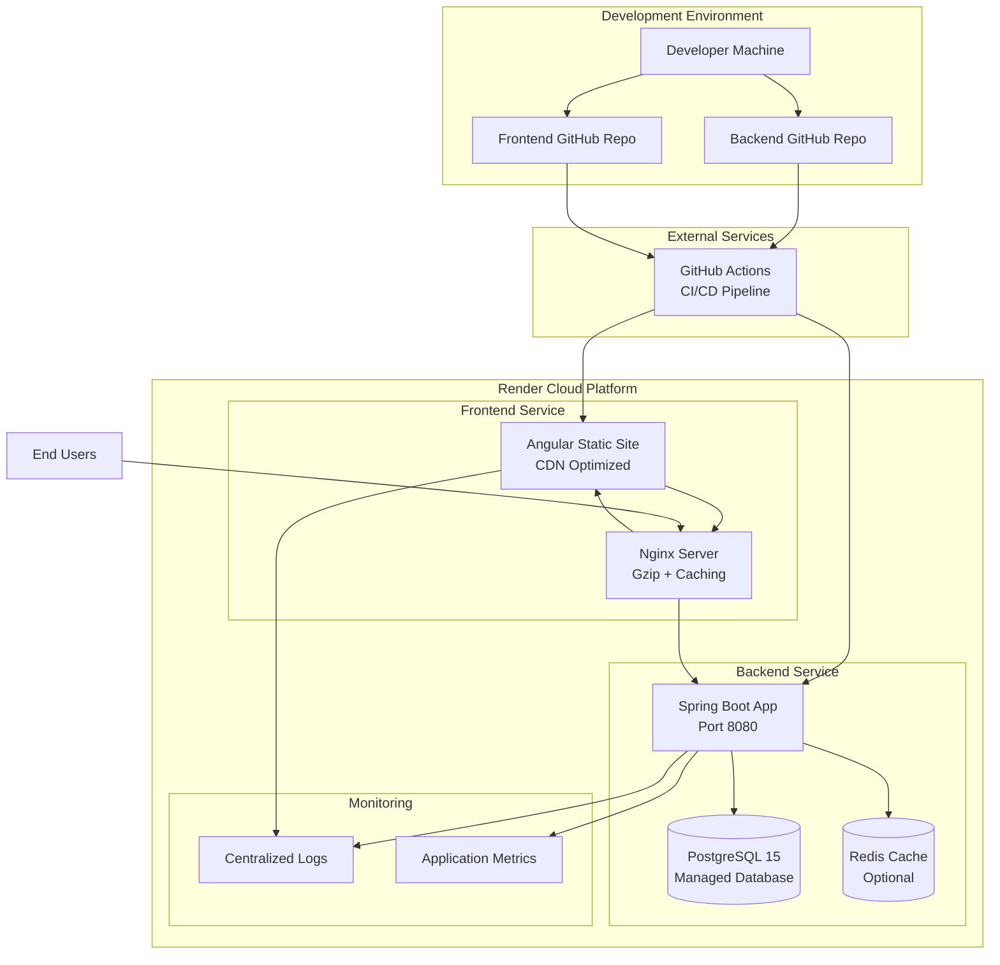

# Design Document

## Overview

FRC eFact es una aplicación web full-stack que implementa una arquitectura de microservicios separando claramente el backend (Spring Boot + PostgreSQL) del frontend (Angular 17 + Material Design). La aplicación utiliza autenticación JWT y está diseñada para deployment en Render con integración continua desde GitHub.

### Architecture Principles

- **Separation of Concerns**: Backend y frontend completamente desacoplados
- **API-First Design**: Backend expone APIs REST y GraphQL bien documentadas
- **Security by Design**: Autenticación JWT con validación en cada request
- **Cloud-Ready**: Configuración optimizada para deployment en Render
- **Database-First**: Migraciones controladas con Flyway

## Architecture

### High-Level Architecture



### Technology Stack

**Backend (frc-efact-backend)**
- Spring Boot 3.2+ (Java 17+)
- Spring Security 6+ (JWT Authentication)
- Spring Data JPA + Hibernate
- PostgreSQL 15+ (con HikariCP connection pool)
- Flyway Migration (versioning automático)
- OpenAPI 3 (Swagger UI integrado)
- GraphQL (Spring GraphQL con GraphiQL)
- Maven 3.9+ build system
- Logback para logging estructurado
- Actuator para health checks y métricas

**Frontend (frc-efact-frontend)**
- Angular 17 (con standalone components)
- Angular Material 17 + CDK
- TypeScript 5+
- RxJS 7+ para programación reactiva
- Angular Router con lazy loading
- Angular HTTP Client con interceptors
- Angular Flex Layout + CSS Grid
- PWA capabilities (Service Worker)
- Angular CLI para build optimization

## Components and Interfaces

### Backend Components

#### 1. Authentication Module
```java
@RestController
@RequestMapping("/api/auth")
public class AuthController {
    // POST /api/auth/login
    // POST /api/auth/refresh
    // POST /api/auth/logout
}

@Service
public class AuthService {
    // JWT token generation and validation
    // User authentication logic
}
```

#### 2. User Management Module
```java
@Entity
public class User {
    private Long id;
    private String username;
    private String email;
    private String passwordHash;
    private LocalDateTime createdAt;
    private LocalDateTime lastLogin;
}

@Repository
public interface UserRepository extends JpaRepository<User, Long> {
    Optional<User> findByUsername(String username);
    Optional<User> findByEmail(String email);
}
```

#### 3. Security Configuration
```java
@Configuration
@EnableWebSecurity
public class SecurityConfig {
    // JWT filter configuration
    // CORS configuration for Angular frontend
    // Security rules for API endpoints
}
```

#### 4. Database Migration Structure
```
src/main/resources/db/migration/
├── V1__Create_users_table.sql
├── V2__Add_user_indexes.sql
└── V3__Add_user_roles.sql
```

### Frontend Components

#### 1. Authentication Module
```typescript
// auth.service.ts
@Injectable()
export class AuthService {
  login(credentials: LoginRequest): Observable<AuthResponse>
  logout(): void
  refreshToken(): Observable<AuthResponse>
  isAuthenticated(): boolean
}

// auth.guard.ts
@Injectable()
export class AuthGuard implements CanActivate {
  // Route protection logic
}
```

#### 2. Core Components
```typescript
// login.component.ts
@Component({
  selector: 'app-login',
  templateUrl: './login.component.html'
})
export class LoginComponent {
  loginForm: FormGroup
  onSubmit(): void
}

// welcome.component.ts
@Component({
  selector: 'app-welcome',
  templateUrl: './welcome.component.html'
})
export class WelcomeComponent implements OnInit {
  user: User
  ngOnInit(): void
}
```

#### 3. Shared Module
```typescript
// Material Design components
// Common pipes and directives
// Shared services (HTTP interceptors, error handling)
```

### API Interfaces

#### REST API Endpoints
```yaml
# OpenAPI 3.0 Specification
/api/auth/login:
  post:
    summary: User authentication
    requestBody:
      content:
        application/json:
          schema:
            type: object
            properties:
              username: string
              password: string

/api/auth/refresh:
  post:
    summary: Refresh JWT token
    
/api/users/profile:
  get:
    summary: Get current user profile
    security:
      - bearerAuth: []
```

#### GraphQL Schema
```graphql
type User {
  id: ID!
  username: String!
  email: String!
  createdAt: String!
  lastLogin: String
}

type Query {
  currentUser: User
}

type Mutation {
  login(username: String!, password: String!): AuthPayload
}

type AuthPayload {
  token: String!
  user: User!
}
```

## Data Models

### Database Standards and Conventions

#### Naming Conventions
- **Idioma**: Bilingüe (Español/Inglés)
  - Campos específicos del dominio: **Español** (ej: `nombre_completo`, `fecha_nacimiento`)
  - Campos genéricos/técnicos: **Inglés** (ej: `id`, `is_active`, `username`)
- **Esquemas**: Todas las tablas deben estar organizadas en esquemas lógicos
  - Ejemplo: `persona.usuario`, `factura.documento`, `catalogo.producto`
- **Tablas**: Nombres en singular, snake_case (ej: `usuario`, `documento_fiscal`)
- **Columnas**: snake_case (ej: `creado_en`, `actualizado_por`)

#### Java Entity Naming Conventions
- **Entidades**: Preferiblemente en **Español** (ej: `Usuario`, `Documento`, `Factura`)
- **Excepciones**: Nombres técnicos o que suenan mejor en inglés pueden mantenerse en inglés (ej: `Login`, `Token`, `Session`)
- **Repositorios**: Seguir el nombre de la entidad + "Repository" (ej: `UsuarioRepository`, `DocumentoRepository`)
- **Servicios**: Seguir el nombre de la entidad + "Service" (ej: `UsuarioService`, `DocumentoService`)
- **Controladores**: Seguir el nombre de la entidad + "Controller" (ej: `UsuarioController`, `DocumentoController`)
- **DTOs**: Seguir el nombre de la entidad + sufijo descriptivo (ej: `UsuarioDto`, `LoginRequest`, `AuthResponse`)

**Ejemplos de nomenclatura:**
```java
// Entidades en español
@Entity
public class Usuario { }

@Entity
public class Documento { }

@Entity
public class Factura { }

// Entidades técnicas en inglés (cuando suena mejor)
@Entity
public class Login { }

@Entity
public class Token { }

// Repositorios
public interface UsuarioRepository extends JpaRepository<Usuario, Long> { }
public interface DocumentoRepository extends JpaRepository<Documento, Long> { }

// Servicios
@Service
public class UsuarioService { }

@Service
public class DocumentoService { }
```

#### Standard Audit Fields (Required for all tables)
Todas las tablas deben incluir estos campos de auditoría:

```sql
-- Campos obligatorios de auditoría
id BIGSERIAL PRIMARY KEY,                    -- Identificador único
creado_en TIMESTAMP DEFAULT CURRENT_TIMESTAMP NOT NULL,  -- Fecha de creación
creado_por VARCHAR(50),                      -- Usuario que creó el registro
actualizado_en TIMESTAMP DEFAULT CURRENT_TIMESTAMP NOT NULL,  -- Fecha de última actualización
actualizado_por VARCHAR(50)                  -- Usuario que actualizó el registro
```

#### Trigger Function for Audit Fields
Función reutilizable para actualizar automáticamente `actualizado_en`:

```sql
CREATE OR REPLACE FUNCTION actualizar_timestamp_modificacion()
RETURNS TRIGGER AS $$
BEGIN
    NEW.actualizado_en = CURRENT_TIMESTAMP;
    RETURN NEW;
END;
$$ LANGUAGE plpgsql;

-- Aplicar a cada tabla:
CREATE TRIGGER trigger_actualizar_[tabla]_timestamp
    BEFORE UPDATE ON [esquema].[tabla]
    FOR EACH ROW
    EXECUTE FUNCTION actualizar_timestamp_modificacion();
```

#### Schema Organization
```sql
-- Esquema para entidades de personas y usuarios
CREATE SCHEMA IF NOT EXISTS persona;
COMMENT ON SCHEMA persona IS 'Schema para entidades relacionadas con personas y usuarios';

-- Esquema para documentos fiscales
CREATE SCHEMA IF NOT EXISTS factura;
COMMENT ON SCHEMA factura IS 'Schema para documentos de facturación electrónica';

-- Esquema para catálogos y configuraciones
CREATE SCHEMA IF NOT EXISTS catalogo;
COMMENT ON SCHEMA catalogo IS 'Schema para catálogos y tablas de configuración';
```

### Database Schema

#### Usuario Table (persona.usuario)
```sql
CREATE TABLE persona.usuario (
    -- Primary key
    id BIGSERIAL PRIMARY KEY,
    
    -- User identification
    username VARCHAR(50) UNIQUE NOT NULL,
    email VARCHAR(100) UNIQUE NOT NULL,
    password_hash VARCHAR(255) NOT NULL,
    
    -- User status
    is_active BOOLEAN DEFAULT true,
    intentos_fallidos_login INTEGER DEFAULT 0,
    bloqueado_hasta TIMESTAMP,
    ultimo_login TIMESTAMP,
    
    -- Audit fields (standard for all tables)
    creado_en TIMESTAMP DEFAULT CURRENT_TIMESTAMP NOT NULL,
    creado_por VARCHAR(50),
    actualizado_en TIMESTAMP DEFAULT CURRENT_TIMESTAMP NOT NULL,
    actualizado_por VARCHAR(50)
);

-- Indexes
CREATE INDEX idx_usuario_username ON persona.usuario(username);
CREATE INDEX idx_usuario_email ON persona.usuario(email);
CREATE INDEX idx_usuario_is_active ON persona.usuario(is_active);
CREATE INDEX idx_usuario_creado_en ON persona.usuario(creado_en);

-- Comments for documentation
COMMENT ON TABLE persona.usuario IS 'Tabla de usuarios del sistema con información de autenticación';
COMMENT ON COLUMN persona.usuario.id IS 'Identificador único del usuario';
COMMENT ON COLUMN persona.usuario.username IS 'Nombre de usuario único para login';
COMMENT ON COLUMN persona.usuario.creado_en IS 'Fecha y hora de creación del registro';
COMMENT ON COLUMN persona.usuario.creado_por IS 'Usuario que creó el registro';
```

### TypeScript Interfaces

```typescript
// Frontend data models
export interface User {
  id: number;
  username: string;
  email: string;
  createdAt: string;
  lastLogin?: string;
}

export interface LoginRequest {
  username: string;
  password: string;
}

export interface AuthResponse {
  token: string;
  refreshToken: string;
  user: User;
}
```

## Error Handling

### Backend Error Handling
```java
@ControllerAdvice
public class GlobalExceptionHandler {
    @ExceptionHandler(AuthenticationException.class)
    public ResponseEntity<ErrorResponse> handleAuthenticationException(
        AuthenticationException ex) {
        // Return 401 with error details
    }
    
    @ExceptionHandler(ValidationException.class)
    public ResponseEntity<ErrorResponse> handleValidationException(
        ValidationException ex) {
        // Return 400 with validation errors
    }
}
```

### Frontend Error Handling
```typescript
@Injectable()
export class ErrorInterceptor implements HttpInterceptor {
  intercept(req: HttpRequest<any>, next: HttpHandler): Observable<HttpEvent<any>> {
    return next.handle(req).pipe(
      catchError((error: HttpErrorResponse) => {
        // Handle different error types
        // Show user-friendly messages
        // Redirect to login on 401
      })
    );
  }
}
```

## Testing Strategy

### Backend Testing Pyramid

#### Unit Tests (JUnit 5 + Mockito)
```java
@ExtendWith(MockitoExtension.class)
class AuthServiceTest {
    @Mock private UserRepository userRepository;
    @Mock private JwtTokenProvider tokenProvider;
    @InjectMocks private AuthService authService;
    
    @Test
    void shouldAuthenticateValidUser() {
        // Test implementation
    }
}
```

#### Integration Tests (TestContainers + @SpringBootTest)
```java
@SpringBootTest(webEnvironment = RANDOM_PORT)
@Testcontainers
class AuthControllerIntegrationTest {
    @Container
    static PostgreSQLContainer<?> postgres = new PostgreSQLContainer<>("postgres:15");
    
    @Test
    void shouldLoginSuccessfully() {
        // Full integration test with real database
    }
}
```

#### Security Tests
```java
@Test
@WithMockUser(roles = "USER")
void shouldAccessProtectedEndpoint() {
    // Test JWT authentication and authorization
}
```

### Frontend Testing Strategy

#### Unit Tests (Jest + Angular Testing Utilities)
```typescript
describe('AuthService', () => {
  let service: AuthService;
  let httpMock: HttpTestingController;

  beforeEach(() => {
    TestBed.configureTestingModule({
      imports: [HttpClientTestingModule],
      providers: [AuthService]
    });
  });

  it('should authenticate user successfully', () => {
    // Test service logic
  });
});
```

#### Component Tests (Angular Testing Library)
```typescript
describe('LoginComponent', () => {
  it('should display error message on invalid credentials', async () => {
    const { getByRole, getByText } = await render(LoginComponent);
    // Test component behavior
  });
});
```

#### E2E Tests (Cypress)
```typescript
describe('Authentication Flow', () => {
  it('should complete login journey', () => {
    cy.visit('/login');
    cy.get('[data-cy=username]').type('testuser');
    cy.get('[data-cy=password]').type('password');
    cy.get('[data-cy=login-button]').click();
    cy.url().should('include', '/welcome');
  });
});
```

### Test Coverage and Quality Gates

#### Coverage Requirements
- **Backend Services**: 85% line coverage mínimo
- **Frontend Components**: 80% line coverage mínimo
- **Critical Paths**: 95% coverage (auth, security)
- **E2E Scenarios**: 100% happy path coverage

#### Quality Gates (SonarQube Integration)
- No critical security vulnerabilities
- No code smells de alta prioridad
- Duplicación de código < 3%
- Complejidad ciclomática < 10 por método

#### Performance Testing
```yaml
# k6 performance tests
scenarios:
  login_load_test:
    executor: ramping-vus
    stages:
      - duration: 2m
        target: 100  # Ramp up to 100 users
      - duration: 5m
        target: 100  # Stay at 100 users
      - duration: 2m
        target: 0    # Ramp down
```

## Deployment Architecture

### Render Configuration

#### Backend Service Configuration

**Render Web Service Settings:**
- **Environment**: Java 17
- **Build Command**: `./mvnw clean package -Dmaven.test.skip=true`
- **Start Command**: `java -Dserver.port=$PORT -jar target/frc-efact-backend-*.jar`
- **Health Check**: `/actuator/health`
- **Auto-Deploy**: Enabled from main branch

**Environment Variables:**
```yaml
DATABASE_URL: [from managed PostgreSQL]
JWT_SECRET: [generated secure key]
JWT_EXPIRATION: 86400000  # 24 hours
SPRING_PROFILES_ACTIVE: production
CORS_ALLOWED_ORIGINS: https://frc-efact-frontend.onrender.com
LOG_LEVEL: INFO
ACTUATOR_ENDPOINTS_ENABLED: true
```

**Database Configuration:**
- **Type**: PostgreSQL 15
- **Instance**: Shared (upgradeable to dedicated)
- **Backup**: Daily automated backups
- **Connection Pool**: HikariCP (max 10 connections)

#### Frontend Service Configuration

**Render Static Site Settings:**
- **Build Command**: `npm ci && npm run build:prod`
- **Publish Directory**: `dist/frc-efact-frontend`
- **Node Version**: 18.x
- **Auto-Deploy**: Enabled from main branch

**Build Environment Variables:**
```yaml
NODE_ENV: production
API_BASE_URL: https://frc-efact-backend.onrender.com
ENABLE_PWA: true
BUILD_OPTIMIZATION: true
```

**Nginx Configuration (Custom):**
```nginx
# Gzip compression
gzip on;
gzip_types text/css application/javascript application/json;

# Cache static assets
location ~* \.(js|css|png|jpg|jpeg|gif|ico|svg)$ {
    expires 1y;
    add_header Cache-Control "public, immutable";
}

# SPA routing
location / {
    try_files $uri $uri/ /index.html;
}

# Security headers
add_header X-Frame-Options DENY;
add_header X-Content-Type-Options nosniff;
add_header X-XSS-Protection "1; mode=block";
```

### Environment Configuration

#### Development Environment
- Backend: `application-dev.yml` con H2/PostgreSQL local
- Frontend: `environment.ts` apuntando a localhost:8080
- Hot reload habilitado para ambos servicios

#### Production Environment
- Backend: `application-prod.yml` con PostgreSQL de Render
- Frontend: `environment.prod.ts` con URLs de producción
- Optimizaciones de build habilitadas

### CI/CD Pipeline

#### GitHub Actions Workflow (Backend)
```yaml
name: Backend CI/CD
on:
  push:
    branches: [main, develop]
    paths: ['frc-efact-backend/**']

jobs:
  test:
    runs-on: ubuntu-latest
    steps:
      - uses: actions/checkout@v4
      - uses: actions/setup-java@v4
        with:
          java-version: '17'
      - name: Run tests
        run: ./mvnw test
      - name: Generate test report
        uses: dorny/test-reporter@v1

  deploy:
    needs: test
    if: github.ref == 'refs/heads/main'
    runs-on: ubuntu-latest
    steps:
      - name: Deploy to Render
        uses: render-deploy-action@v1
```

#### GitHub Actions Workflow (Frontend)
```yaml
name: Frontend CI/CD
on:
  push:
    branches: [main, develop]
    paths: ['frc-efact-frontend/**']

jobs:
  test:
    runs-on: ubuntu-latest
    steps:
      - uses: actions/checkout@v4
      - uses: actions/setup-node@v4
        with:
          node-version: '18'
      - name: Install dependencies
        run: npm ci
      - name: Run tests
        run: npm run test:ci
      - name: Run e2e tests
        run: npm run e2e:ci

  build-and-deploy:
    needs: test
    if: github.ref == 'refs/heads/main'
    runs-on: ubuntu-latest
    steps:
      - name: Build and deploy
        run: npm run build:prod
```

#### Deployment Flow
1. **Developer Push** → GitHub repository
2. **GitHub Actions** → Run tests and quality checks
3. **Render Webhook** → Automatic deployment on success
4. **Database Migration** → Flyway runs automatically on backend startup
5. **Health Checks** → Verify deployment success
6. **Rollback** → Automatic rollback on health check failure

## Security Considerations

### Authentication Flow
1. User submits credentials to `/api/auth/login`
2. Backend validates credentials against database
3. JWT token generated with user claims
4. Frontend stores token in memory (not localStorage for security)
5. Token included in Authorization header for protected requests
6. Backend validates JWT on each protected endpoint

### Security Headers
```java
// CORS configuration
@CrossOrigin(origins = {"http://localhost:4200", "https://frc-efact-frontend.onrender.com"})

// Security headers
http.headers()
    .frameOptions().deny()
    .contentTypeOptions().and()
    .httpStrictTransportSecurity(hstsConfig -> hstsConfig
        .maxAgeInSeconds(31536000)
        .includeSubdomains(true));
```

### Password Security
- BCrypt hashing con salt rounds configurables
- Password validation en frontend y backend
- Rate limiting en endpoints de autenticación
##
 Performance and Scalability Considerations

### Backend Performance
- **Connection Pooling**: HikariCP configurado para 10-20 conexiones máximo
- **Caching Strategy**: Redis para sesiones JWT y datos frecuentes
- **Database Optimization**: Índices en columnas de búsqueda frecuente
- **JVM Tuning**: Configuración optimizada para contenedores Render

### Frontend Performance
- **Bundle Optimization**: Lazy loading de módulos no críticos
- **Tree Shaking**: Eliminación de código no utilizado
- **PWA Features**: Service Worker para caching offline
- **CDN Integration**: Assets estáticos servidos desde CDN de Render

### Monitoring and Observability

#### Application Metrics (Micrometer + Actuator)
```java
@Component
public class CustomMetrics {
    private final Counter loginAttempts;
    private final Timer loginDuration;
    
    public CustomMetrics(MeterRegistry meterRegistry) {
        this.loginAttempts = Counter.builder("login.attempts")
            .register(meterRegistry);
        this.loginDuration = Timer.builder("login.duration")
            .register(meterRegistry);
    }
}
```

#### Health Checks
```java
@Component
public class DatabaseHealthIndicator implements HealthIndicator {
    @Override
    public Health health() {
        // Check database connectivity
        // Check critical tables existence
        return Health.up().withDetail("database", "PostgreSQL OK").build();
    }
}
```

#### Logging Strategy
```yaml
# logback-spring.xml
logging:
  level:
    com.frcefact: INFO
    org.springframework.security: DEBUG
  pattern:
    console: "%d{HH:mm:ss.SSS} [%thread] %-5level %logger{36} - %msg%n"
    file: "%d{yyyy-MM-dd HH:mm:ss} [%thread] %-5level %logger{36} - %msg%n"
  file:
    name: logs/frc-efact-backend.log
```

## Migration and Deployment Strategy

### Database Migration Strategy
```sql
-- V1__Initial_schema.sql
CREATE SCHEMA IF NOT EXISTS frc_efact;

-- V2__Create_users_table.sql
CREATE TABLE frc_efact.users (
    id BIGSERIAL PRIMARY KEY,
    username VARCHAR(50) UNIQUE NOT NULL,
    email VARCHAR(100) UNIQUE NOT NULL,
    password_hash VARCHAR(255) NOT NULL,
    created_at TIMESTAMP DEFAULT CURRENT_TIMESTAMP,
    updated_at TIMESTAMP DEFAULT CURRENT_TIMESTAMP,
    last_login TIMESTAMP,
    is_active BOOLEAN DEFAULT true,
    failed_login_attempts INTEGER DEFAULT 0,
    locked_until TIMESTAMP
);

-- V3__Add_indexes.sql
CREATE INDEX idx_users_username ON frc_efact.users(username);
CREATE INDEX idx_users_email ON frc_efact.users(email);
CREATE INDEX idx_users_active ON frc_efact.users(is_active);
```

### Zero-Downtime Deployment
1. **Blue-Green Strategy**: Render maneja automáticamente
2. **Health Checks**: Verificación antes de switch de tráfico
3. **Database Migrations**: Compatibles hacia atrás
4. **Rollback Plan**: Automático en caso de fallas

### Environment Promotion
```
Development → Staging → Production
     ↓           ↓         ↓
   Local DB → Test DB → Prod DB
```

## Security Deep Dive

### JWT Token Strategy
```java
@Component
public class JwtTokenProvider {
    private final String jwtSecret;
    private final int jwtExpirationMs;
    
    public String generateToken(UserPrincipal userPrincipal) {
        Date expiryDate = new Date(System.currentTimeMillis() + jwtExpirationMs);
        
        return Jwts.builder()
            .setSubject(Long.toString(userPrincipal.getId()))
            .setIssuedAt(new Date())
            .setExpiration(expiryDate)
            .signWith(SignatureAlgorithm.HS512, jwtSecret)
            .compact();
    }
}
```

### Rate Limiting
```java
@Component
public class RateLimitingFilter implements Filter {
    private final RedisTemplate<String, String> redisTemplate;
    
    @Override
    public void doFilter(ServletRequest request, ServletResponse response, 
                        FilterChain chain) throws IOException, ServletException {
        // Implement rate limiting logic
        // 5 login attempts per minute per IP
    }
}
```

### SSL/HTTPS Configuration

#### Render SSL Certificate
- **Automatic SSL**: Render proporciona certificados SSL automáticos para todos los dominios
- **Custom Domain**: Soporte para dominios personalizados con SSL gratuito
- **HTTPS Redirect**: Redirección automática de HTTP a HTTPS
- **TLS Version**: TLS 1.2+ soportado por defecto

#### Backend SSL Configuration
```java
# application-prod.yml
server:
  port: ${PORT:8080}
  ssl:
    enabled: false  # Render maneja SSL en el load balancer
  servlet:
    context-path: /api
  forward-headers-strategy: framework  # Para X-Forwarded-Proto headers

# Security configuration for HTTPS
security:
  require-ssl: true
  headers:
    frame-options: DENY
    content-type-options: nosniff
    xss-protection: 1; mode=block
    strict-transport-security: max-age=31536000; includeSubDomains
```

#### Frontend HTTPS Configuration
```typescript
// environment.prod.ts
export const environment = {
  production: true,
  apiUrl: 'https://frc-efact-backend.onrender.com/api',
  enableHttps: true,
  secureOnly: true  // Cookies solo por HTTPS
};

// Angular HTTP Interceptor para HTTPS
@Injectable()
export class HttpsInterceptor implements HttpInterceptor {
  intercept(req: HttpRequest<any>, next: HttpHandler): Observable<HttpEvent<any>> {
    // Asegurar que todas las requests usen HTTPS en producción
    if (environment.production && req.url.startsWith('http://')) {
      const httpsReq = req.clone({
        url: req.url.replace('http://', 'https://')
      });
      return next.handle(httpsReq);
    }
    return next.handle(req);
  }
}
```

### CORS Configuration
```java
@Configuration
public class CorsConfig {
    @Bean
    public CorsConfigurationSource corsConfigurationSource() {
        CorsConfiguration configuration = new CorsConfiguration();
        configuration.setAllowedOriginPatterns(Arrays.asList(
            "http://localhost:4200",           // Development
            "https://localhost:4200",          // Development SSL
            "https://*.onrender.com",          // Production
            "https://frc-efact-frontend.onrender.com"  // Specific production URL
        ));
        configuration.setAllowedMethods(Arrays.asList("GET", "POST", "PUT", "DELETE", "OPTIONS"));
        configuration.setAllowedHeaders(Arrays.asList("*"));
        configuration.setAllowCredentials(true);
        configuration.setMaxAge(3600L);  // Cache preflight for 1 hour
        
        UrlBasedCorsConfigurationSource source = new UrlBasedCorsConfigurationSource();
        source.registerCorsConfiguration("/**", configuration);
        return source;
    }
}
```

### Security Headers for HTTPS
```java
@Configuration
@EnableWebSecurity
public class SecurityConfig {
    
    @Bean
    public SecurityFilterChain filterChain(HttpSecurity http) throws Exception {
        http
            .requiresChannel(channel -> 
                channel.requestMatchers(r -> r.getHeader("X-Forwarded-Proto") != null)
                       .requiresSecure())  // Force HTTPS when behind proxy
            .headers(headers -> headers
                .frameOptions().deny()
                .contentTypeOptions().and()
                .httpStrictTransportSecurity(hstsConfig -> hstsConfig
                    .maxAgeInSeconds(31536000)
                    .includeSubdomains(true)
                    .preload(true))
                .and()
            );
        return http.build();
    }
}
```
## S
SL/HTTPS Security Checklist

### Production HTTPS Requirements ✅

1. **Automatic SSL Certificate**: Render proporciona certificados SSL gratuitos y automáticos
2. **HTTPS Redirect**: Todas las requests HTTP se redirigen automáticamente a HTTPS
3. **HSTS Headers**: Strict Transport Security configurado para forzar HTTPS
4. **Secure Cookies**: JWT tokens y cookies de sesión marcados como `Secure` y `SameSite`
5. **Mixed Content Prevention**: Todas las resources (CSS, JS, images) servidas por HTTPS

### JWT Token Security over HTTPS
```java
@Component
public class JwtTokenProvider {
    
    public ResponseCookie createJwtCookie(String token) {
        return ResponseCookie.from("jwt", token)
            .httpOnly(true)           // Previene acceso desde JavaScript
            .secure(true)             // Solo por HTTPS
            .sameSite("Strict")       // Protección CSRF
            .maxAge(Duration.ofHours(24))
            .path("/")
            .build();
    }
}
```

### Frontend Security Configuration
```typescript
// Angular HTTP Client configuration
@Injectable()
export class AuthInterceptor implements HttpInterceptor {
  intercept(req: HttpRequest<any>, next: HttpHandler): Observable<HttpEvent<any>> {
    // Asegurar HTTPS en producción
    if (environment.production) {
      const secureReq = req.clone({
        setHeaders: {
          'X-Requested-With': 'XMLHttpRequest',
          'Content-Type': 'application/json'
        },
        // Incluir credentials para cookies seguras
        withCredentials: true
      });
      return next.handle(secureReq);
    }
    return next.handle(req);
  }
}
```

### Development vs Production SSL

#### Development Environment
```yaml
# application-dev.yml
server:
  port: 8080
  ssl:
    enabled: false  # HTTP para desarrollo local

cors:
  allowed-origins: 
    - http://localhost:4200
    - https://localhost:4200  # Si se usa SSL local
```

#### Production Environment
```yaml
# application-prod.yml
server:
  port: ${PORT:8080}
  ssl:
    enabled: false  # Render maneja SSL en el proxy
  forward-headers-strategy: framework

cors:
  allowed-origins:
    - https://frc-efact-frontend.onrender.com

security:
  require-ssl: true
  cookie:
    secure: true
    same-site: strict
```

### SSL Certificate Verification
- **Render SSL**: Certificados Let's Encrypt renovados automáticamente
- **Custom Domain**: Soporte para dominios personalizados con SSL gratuito
- **Certificate Monitoring**: Render monitorea y renueva certificados automáticamente
- **TLS Configuration**: TLS 1.2+ con cipher suites seguros por defecto